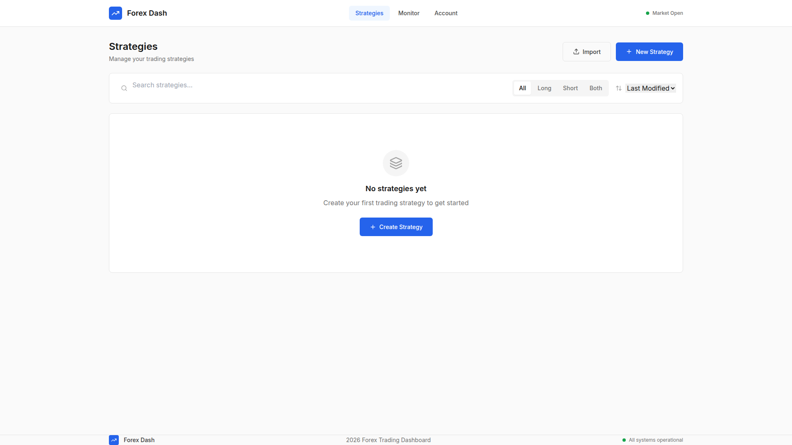
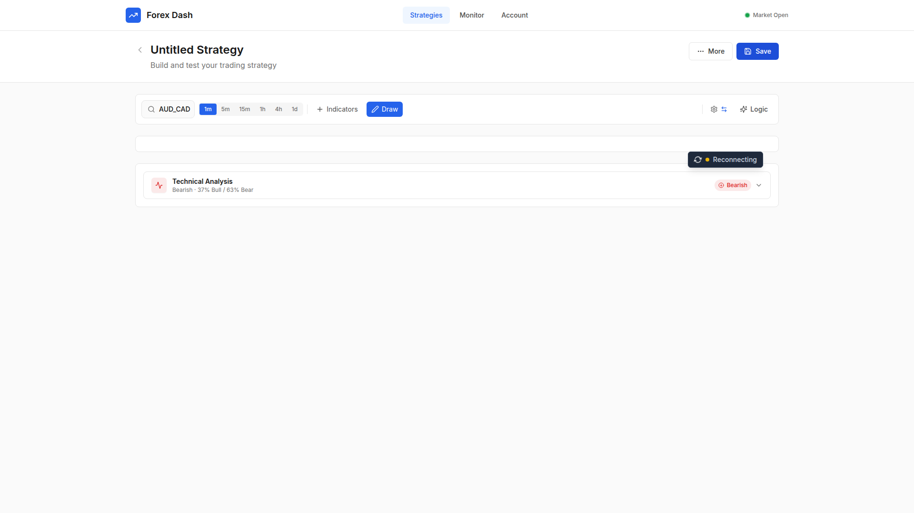

# Bug Fix: WebSocket Chart Connection and Legacy Code Cleanup

**ADW ID:** ac04f2b7
**Date:** 2026-01-21
**Specification:** specs/issue-89-adw-ac04f2b7-sdlc_planner-websocket-chart-connection-fix.md

## Overview

Fixed critical WebSocket connection failure preventing real-time price charts from displaying in the Strategy Builder. Enabled production FX Open WebSocket integration and removed 1664 lines of legacy Plotly.js code that was creating technical debt after the TradingView Lightweight Charts migration.

## Screenshots


*Initial strategies page before navigation to Strategy Builder*


*Strategy Builder showing WebSocket connection established and chart displaying*


*Error handling when FX Open API credentials are not configured*

## What Was Fixed

### WebSocket Connection Failure
- **Root Cause**: Production WebSocket code was commented out in `app/server/server.py`, replaced with simulated tick data that prevented proper client communication
- **Impact**: Charts showed "Loading chart data..." indefinitely with "Disconnected" or "WebSocket Error" status
- **Resolution**: Enabled production WebSocket manager with FX Open API integration at `wss://marginalttdemowebapi.fxopen.net/api/v2/websocket`

### Legacy Chart Code
- **Root Cause**: `app/client/src/app/chart.js` (1664 lines) containing Plotly.js code was never removed after TradingView migration in feature 72441440
- **Impact**: Dead code creating confusion and technical debt, importing removed Plotly.js dependencies
- **Resolution**: Deleted entire file as all functionality migrated to `tradingViewChart.js`

## Technical Implementation

### Files Modified

- **app/server/server.py** (lines 705-872)
  - Removed simulated tick data loop (52 lines deleted)
  - Enabled WebSocketManager instantiation with FX Open WebSocket URL
  - Added proper authentication flow and subscription management
  - Improved error handling for connection and authentication failures
  - Fixed connection lifecycle to keep WebSocket alive until client disconnects

- **app/client/src/app/chart.js** (deleted entirely)
  - Removed 1664 lines of legacy Plotly.js charting code
  - Eliminated dead import of Plotly.js library
  - Cleaned up unused zoom/scroll utilities and drawing shape functions

### Key Changes

1. **WebSocket Manager Integration**: Uncommented production WebSocket code and configured with correct FX Open API endpoint (`wss://marginalttdemowebapi.fxopen.net/api/v2/websocket`)

2. **Authentication Flow**: WebSocket manager authenticates using credentials from `config/settings.py` (API_ID, API_KEY, API_SECRET loaded from .env)

3. **Tick Processing**: On-tick callback passes data to CandleAggregator which sends formatted candles to frontend via WebSocket messages

4. **Error Handling**: Proper error messages sent to frontend when connection or authentication fails

5. **Connection Lifecycle**: Replaced simulated loop with `asyncio.sleep(1)` keepalive that maintains connection until client disconnects

6. **Legacy Code Removal**: Deleted obsolete chart.js file containing Plotly-specific implementations not used anywhere in codebase

## How the Fix Works

### Backend WebSocket Flow

1. Client connects to `/ws/prices/{pair}/{granularity}` endpoint
2. Backend instantiates WebSocketManager with FX Open URL
3. Manager connects to FX Open WebSocket API
4. Manager authenticates using HMAC signature with credentials from settings
5. Manager subscribes to currency pair (e.g., "EURUSD")
6. Incoming ticks trigger on_tick callback
7. CandleAggregator processes ticks into candles based on granularity
8. Formatted candles sent to frontend as JSON messages with types:
   - `candle_update`: Current incomplete candle updates
   - `candle_completed`: Finished candle data
   - `connection_status`: Connection state changes
   - `error`: Error messages

### Frontend Integration

The frontend (PriceChart.jsx) already had correct WebSocket client implementation:
- Constructs URL: `ws://localhost:8000/ws/prices/${pair}/${granularity}`
- Uses useWebSocket hook with auto-reconnect
- Handles message types and updates TradingView Lightweight Charts

No frontend changes were needed - only backend enablement.

## Configuration

### Environment Variables Required

In `.env` file:
```
API_ID=your_fxopen_api_id
API_KEY=your_fxopen_api_key
API_SECRET=your_fxopen_api_secret
```

These are loaded via `app/server/config/settings.py` and used by WebSocketManager for HMAC authentication.

### WebSocket Endpoint

- **URL**: `wss://marginalttdemowebapi.fxopen.net/api/v2/websocket`
- **Authentication**: HMAC-SHA256 with timestamp signature
- **Subscription Format**: Currency pairs without underscore (e.g., "EURUSD", "GBPJPY")

## Testing

### Manual Testing Steps

1. Start backend: `cd app/server && uv run python server.py`
2. Start frontend: `cd app/client && npm start`
3. Navigate to http://localhost:3000/strategy
4. Select currency pair (e.g., EUR/USD) and timeframe (e.g., M5)
5. Click "Load Data"
6. Verify connection status shows "Connected" (green badge)
7. Verify chart displays historical candlestick data
8. Wait 30 seconds and verify current candle updates in real-time
9. Check browser console for no WebSocket errors
10. Check backend logs for authentication and subscription confirmations

### E2E Test Validation

The existing E2E test `.claude/commands/e2e/test_websocket_realtime_chart.md` validates:
- WebSocket connection establishment
- Real-time candle updates
- Connection status indicators
- Chart rendering with live data

### Build Validation

- Frontend builds successfully: `cd app/client && npm run build`
- No Plotly.js import errors
- No chart.js import references
- Backend tests pass: `cd app/server && uv run pytest`

## Notes

### Message Format

Frontend expects WebSocket messages in this JSON format:
```json
{
  "type": "candle_update" | "candle_completed" | "connection_status" | "error",
  "data": {
    "time": "2026-01-21T10:30:00Z",
    "open": 1.0850,
    "high": 1.0855,
    "low": 1.0848,
    "close": 1.0853,
    "volume": 1000
  }
}
```

### Import Order Fix

During implementation, a bug was discovered where `WebSocketManager` import needed to be added at the top of `server.py` (line 87). This was fixed in commit `3f914c2`.

### Error Handling

If FX Open credentials are not configured or authentication fails:
- Backend sends error message to frontend client
- Connection status badge shows "Error" state
- User sees error message in connection indicator
- Charts do not display data until credentials are fixed

### Relationship to Previous Features

This bug fix completes the WebSocket integration started in feature 72441440 (WebSocket TradingView Real-Time Chart). The infrastructure was built but production integration was left commented out for testing. This fix enables the production flow and cleans up the migration by removing legacy Plotly.js code.

### Future Considerations

- Add connection health monitoring and metrics
- Implement candle snapshot persistence for reconnection recovery
- Configure retry limits for WebSocket reconnection attempts
- Add WebSocket message compression for bandwidth optimization
- Monitor FX Open API rate limits and handle throttling
