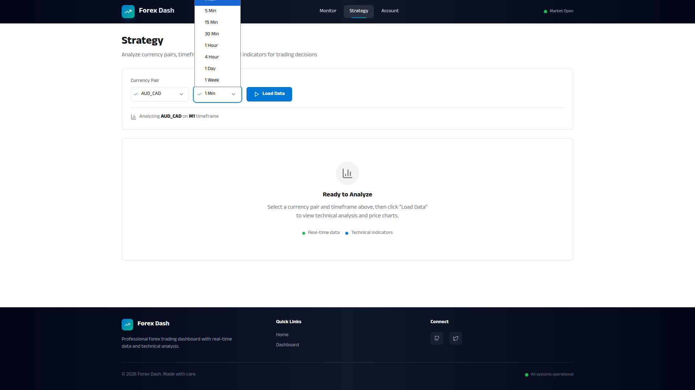

# Timeframe Selector with Session Persistence

**ADW ID:** 085c8952
**Date:** 2026-01-19
**Specification:** specs/issue-36-adw-085c8952-sdlc_planner-timeframe-selector-persistence.md

## Overview

Enhanced timeframe selector for the Strategy page supporting 8 granularity options (M1, M5, M15, M30, H1, H4, D, W1) with localStorage persistence. Traders can analyze markets at their preferred time scale with selections remembered across page refreshes, plus visual enhancements including a timeframe badge in the chart header.

## Screenshots





## What Was Built

- Extended timeframe options from 5 to 8 granularities (added M1, M30, W1)
- Human-readable display labels in dropdown (e.g., "1 Hour" instead of "H1")
- localStorage persistence for user's preferred timeframe
- Visual timeframe badge pill in chart header
- Active state indicator (checkmark) in Select dropdown
- 300ms debounced timeframe switching to prevent API flooding
- Zoom context preservation when switching timeframes
- Info message display for insufficient historical data

## Technical Implementation

### Files Modified

- `app/server/config/settings.py`: Added M1 (60s), M30 (1800s), W1 (604800s) to TFS dictionary
- `app/server/api/routes.py`: Added GRANULARITY_LABELS mapping and updated `make_option()` to support display labels
- `app/client/src/app/data.js`: Extended GRANULARITY_SECONDS with new timeframes, exported for use in Strategy.jsx
- `app/client/src/pages/Strategy.jsx`: Implemented localStorage persistence, debouncing, zoom context preservation, and info messages
- `app/client/src/components/PriceChart.jsx`: Added timeframe badge pill in chart header
- `app/client/src/components/Select.jsx`: Added checkmark indicator for selected option
- `app/server/tests/test_routes.py`: Added comprehensive unit tests for get_options() and make_option()

### Key Changes

- **Backend timeframe config**: TFS dictionary now includes M1, M5, M15, M30, H1, H4, D, W1 with corresponding seconds values
- **Display labels**: GRANULARITY_LABELS maps codes to human-readable text ("1 Min", "5 Min", "15 Min", etc.)
- **Persistence logic**: Uses `forex_dash_preferred_timeframe` localStorage key; validates against available options on load
- **Debouncing**: 300ms delay before API calls when switching timeframes, with cleanup on component unmount
- **Zoom preservation**: Calculates equivalent candle count when switching timeframes using `oldCount * (oldSeconds / newSeconds)`, clamped to 50-500 range

## How to Use

1. Navigate to the Strategy page
2. Click the Timeframe dropdown to see all 8 available options with human-readable labels
3. Select a timeframe (e.g., "1 Hour" for H1)
4. The chart updates with data for the selected timeframe
5. A badge pill appears in the chart header showing the current timeframe
6. Refresh the page - your selected timeframe is automatically restored
7. If you switch timeframes rapidly, only the final selection triggers an API call (debouncing)

## Configuration

- **localStorage Key**: `forex_dash_preferred_timeframe`
- **Debounce Delay**: 300ms
- **Candle Count Range**: 50-500 (for zoom preservation)
- **Available Timeframes**: M1, M5, M15, M30, H1, H4, D, W1

## Testing

Run backend tests:
```bash
cd app/server && uv run pytest tests/test_routes.py -v
```

Run frontend build:
```bash
cd app/client && npm run build
```

E2E test: Execute `.claude/commands/e2e/test_timeframe_selector.md`

## Notes

- The OpenFX API may have limited data availability for M1 and W1 timeframes
- Native HTML `<select>` has limited styling; checkmark indicator is positioned outside the select element
- Invalid localStorage values (e.g., from removed timeframes) gracefully fall back to the first available option
- Debounce timer is cleaned up on component unmount to prevent memory leaks
