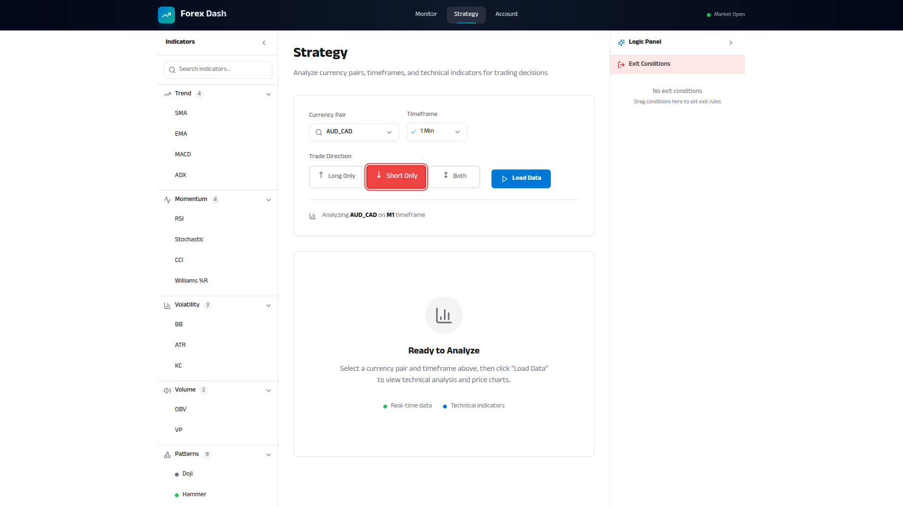

# Trade Direction Selector

**ADW ID:** 45c86c3e
**Date:** 2026-01-19
**Specification:** specs/issue-62-adw-45c86c3e-sdlc_planner-set-trade-direction.md

## Overview

The Trade Direction Selector allows traders to specify whether their strategy executes Long-only trades, Short-only trades, or Both trading directions. The selector dynamically filters the Logic Panel to show only relevant condition sections, reducing complexity and enabling focused strategy development. The selected direction is persisted using localStorage and will support future database persistence.

## Screenshots

### Trade Direction Selector in Controls Card

The Trade Direction Selector is prominently displayed in the Strategy page Controls Card alongside the pair and timeframe selectors.

### Long Only Mode

When "Long Only" is selected, only the Entry Conditions section is visible in the Logic Panel.

### Short Only Mode

When "Short Only" is selected, only the Exit Conditions section is visible in the Logic Panel.

### Both Directions Mode (Default)

When "Both" is selected, both Entry and Exit Conditions sections are visible.

### Persistence After Reload

The selected trade direction persists across page reloads via localStorage.

## What Was Built

- **TradeDirectionSelector Component**: A button group component with three options (Long Only ↑, Short Only ↓, Both ↕) with visual indicators and tooltips
- **Trade Direction State Management**: State management in Strategy.jsx with localStorage persistence
- **Dynamic Logic Panel Filtering**: LogicPanel component now conditionally renders sections based on trade direction
- **Confirmation Dialog**: Warning dialog when switching directions would remove existing conditions
- **Auto-created Condition Filtering**: Indicators and patterns dropped on the chart create conditions in the appropriate section based on trade direction
- **Backend Data Models**: Pydantic models for strategy persistence with trade_direction field
- **Database Migration**: SQL migration for future strategy persistence with trade direction support
- **Constants Module**: Centralized constants for trade directions, labels, icons, and storage keys
- **E2E Test Specification**: Comprehensive end-to-end test for the trade direction workflow

## Technical Implementation

### Files Modified

- `app/client/src/components/TradeDirectionSelector.jsx`: New component with three-button selector, accessibility features, and tooltips
- `app/client/src/app/constants.js`: New file with trade direction constants, labels (Long Only, Short Only, Both), icons (↑, ↓, ↕), and localStorage key
- `app/client/src/pages/Strategy.jsx`: Added trade direction state management with localStorage persistence, confirmation dialog logic, and filtering for auto-created conditions
- `app/client/src/components/LogicPanel.jsx`: Added conditional rendering of Entry/Exit sections based on tradeDirection prop
- `app/client/src/app/conditionDefaults.js`: Updated createConditionFromIndicator and createConditionFromPattern to accept section parameter
- `app/server/core/data_models.py`: Added StrategyConfig, StrategyIndicator, StrategyCondition, SaveStrategyRequest, SaveStrategyResponse, LoadStrategyResponse, StrategyListItem, and ListStrategiesResponse models
- `app/server/db/migrations/002_create_strategies_table.sql`: Database schema migration for forex_strategies table with trade_direction field
- `.claude/commands/e2e/test_trade_direction.md`: E2E test specification with user story, test steps, and success criteria

### Key Changes

1. **State Management**: Trade direction state is initialized from localStorage with a default value of 'both'. Changes are immediately persisted to localStorage using the key `forex_dash_trade_direction`.

2. **Confirmation Dialog**: When switching from 'both' to a single direction with existing incompatible conditions, a confirmation dialog warns the user about condition removal with a specific count (e.g., "You have 3 Exit conditions defined. Switching to Long Only will remove them. Continue?").

3. **Section Filtering**: The LogicPanel receives a `tradeDirection` prop and uses boolean flags (`showEntrySection`, `showExitSection`) to conditionally render sections:
   - Long Only: shows Entry section only
   - Short Only: shows Exit section only
   - Both: shows both sections

4. **Auto-created Conditions**: When indicators or patterns are dropped on the chart, the auto-created condition's section is determined by trade direction:
   - Long Only → creates 'entry' conditions
   - Short Only → creates 'exit' conditions
   - Both → uses the indicator's default template section or 'entry'

5. **Backend Models**: The StrategyConfig model uses a Literal type for trade_direction with values 'long', 'short', or 'both', ensuring type safety and validation at the API level.

## How to Use

1. **Navigate to Strategy Page**: Open the Strategy page in the application

2. **View the Trade Direction Selector**: The selector is located in the Controls Card at the top of the page, next to the pair and timeframe selectors

3. **Select a Trade Direction**:
   - Click "↑ Long Only" to build strategies that only buy (bet on price going up)
   - Click "↓ Short Only" to build strategies that only sell (bet on price going down)
   - Click "↕ Both" to build strategies that can trade in both directions

4. **Add Indicators**: Drag indicators from the Indicator Library onto the chart. Conditions will be auto-created in the appropriate section based on your selected trade direction.

5. **Switch Directions**: If you switch from "Both" to a single direction while having conditions in the section that will be hidden, a confirmation dialog will appear warning you about the removal.

6. **Persistence**: Your selected trade direction is automatically saved and will be restored when you return to the page.

## Configuration

### LocalStorage Key
- `forex_dash_trade_direction`: Stores the current trade direction ('long', 'short', or 'both')

### Constants
All trade direction constants are defined in `app/client/src/app/constants.js`:
- `TRADE_DIRECTIONS.LONG`: 'long'
- `TRADE_DIRECTIONS.SHORT`: 'short'
- `TRADE_DIRECTIONS.BOTH`: 'both'
- `TRADE_DIRECTION_LABELS`: User-friendly labels
- `TRADE_DIRECTION_ICONS`: Unicode icons (↑, ↓, ↕)

### Database Schema (Future)
The `forex_strategies` table includes:
- `trade_direction` column (text, not null)
- Check constraint ensuring values are 'long', 'short', or 'both'

## Testing

### E2E Test
Execute the E2E test specification located at `.claude/commands/e2e/test_trade_direction.md`:

1. Read `.claude/commands/test_e2e.md` to understand the E2E testing process
2. Read `.claude/commands/e2e/test_trade_direction.md` for the specific test steps
3. Verify the following behaviors:
   - Default selection is "Both"
   - Clicking each option changes the visible Logic Panel sections
   - Confirmation dialog appears when removing conditions
   - Trade direction persists after page reload
   - Icons display correctly for each option

### Manual Testing
1. Select "Long Only" and add an indicator - verify only Entry conditions are created
2. Switch to "Both" and add both entry and exit conditions
3. Switch to "Long Only" - verify confirmation dialog appears
4. Cancel the dialog - verify direction stays "Both"
5. Confirm the switch - verify exit conditions are removed
6. Reload the page - verify direction persists

## Notes

### Future Enhancements
- **Strategy Persistence**: Full database persistence when user authentication is implemented
- **Backtesting Integration**: Respect trade direction during backtesting to only execute trades in the configured direction
- **Bot Integration**: Pass trade direction to the trading bot to enforce directional trading
- **Strategy Browser**: Filter and search saved strategies by trade direction
- **Performance Analytics**: Show performance metrics segmented by trade direction

### Technical Considerations
- The existing condition data structure already includes a `section` field ('entry' or 'exit'), making filtering straightforward without data migration
- Strategies without a trade_direction field default to 'both' for backward compatibility
- The confirmation dialog uses specific language about what will be removed (e.g., "3 Exit conditions") to ensure users make informed decisions
- Color coding follows trader conventions: green for Long (up), red for Short (down), blue for Both (neutral)

### Accessibility
- All buttons have proper ARIA labels and aria-pressed states
- Keyboard navigation is supported (Tab, Enter, Space)
- Tooltips provide explanations for each direction option
- Focus indicators are visible for keyboard users
- The component is fully responsive for mobile devices
