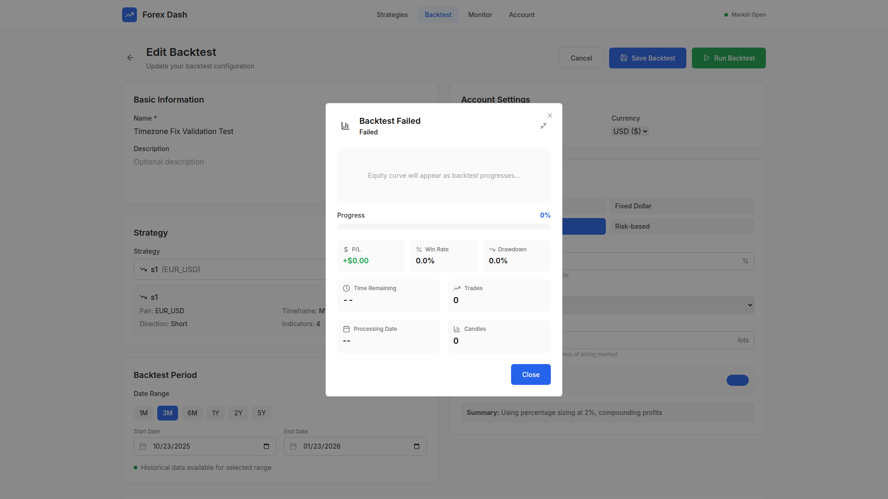
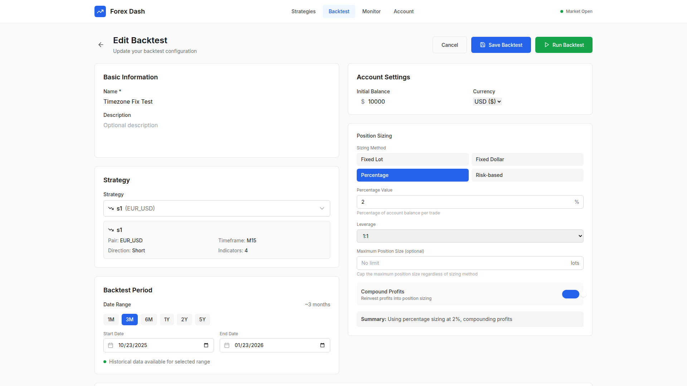
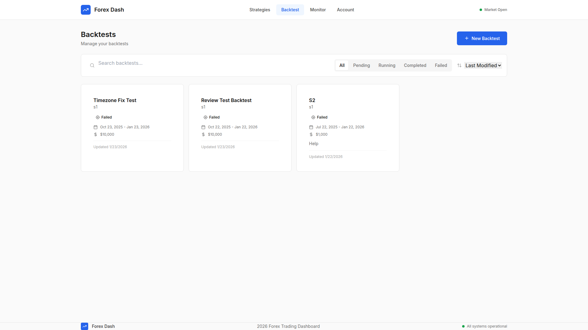

# Datetime Timezone Comparison Fix

**ADW ID:** 4620e8ed
**Date:** 2026-01-23
**Specification:** specs/issue-114-adw-4620e8ed-sdlc_planner-datetime-timezone-comparison-fix.md

## Overview

Fixed a critical bug in the backtest executor that caused backtests to crash with "can't compare offset-naive and offset-aware datetimes" error. The fix normalizes all datetime objects to timezone-naive format immediately after parsing input dates, ensuring consistent datetime comparisons throughout the backtest execution flow.

## Screenshots

### Before Fix - Backtest Failures







### After Fix - Working Backtests


## What Was Built

- **Timezone normalization in backtest executor**: Added consistent timezone handling to prevent comparison errors between timezone-aware and timezone-naive datetime objects
- **Debug logging**: Added comprehensive logging to track timezone state throughout execution
- **Comprehensive timezone normalization**: Applied the fix across all datetime comparison points in the backtest flow

## Technical Implementation

### Files Modified

- `app/server/core/backtest_executor.py`: Fixed timezone handling in backtest execution flow
  - Added timezone normalization after parsing start_date and end_date (lines 448-454)
  - Removed timezone stripping inside candle generation loop (previously line 651)
  - Added timezone normalization for trade entry/exit times (lines 1032-1037, 1204-1234)
  - Added debug logging to track timezone state

### Key Changes

1. **Normalized datetime objects after parsing**: Immediately after parsing `start_date` and `end_date` from ISO format strings, both dates are normalized to timezone-naive by removing timezone information if present.

2. **Removed mid-loop timezone stripping**: Eliminated the problematic line that stripped timezone information inside the candle generation loop, which was causing inconsistent timezone states.

3. **Added comprehensive timezone normalization**: Extended timezone normalization to trade entry/exit times and candle times used for trade counts, ensuring consistency across all datetime comparisons.

4. **Added debug logging**: Implemented logging statements to track timezone state at critical points, making future debugging easier.

5. **Code formatting improvements**: Applied consistent formatting and removed trailing whitespace across the file.

### Root Cause

The bug occurred because:
1. `start_date` and `end_date` were parsed as timezone-aware datetime objects (from ISO format with timezone info)
2. Inside the candle generation loop, `current_time` had its timezone stripped, becoming timezone-naive
3. The while loop condition `current_time <= end_date` failed on the second iteration because it compared timezone-naive against timezone-aware

### Solution Approach

The fix normalizes all datetime objects to timezone-naive immediately after parsing, ensuring consistent timezone awareness throughout the execution:

```python
# Normalize to timezone-naive for consistent comparisons
if start_date.tzinfo is not None:
    start_date = start_date.replace(tzinfo=None)
if end_date.tzinfo is not None:
    end_date = end_date.replace(tzinfo=None)
```

This approach:
- Maintains backward compatibility
- Avoids potential serialization issues
- Ensures all datetime comparisons use the same timezone awareness state
- Requires no database schema or API contract changes

## How to Use

This fix is transparent to end users. Backtests now work correctly without manual intervention:

1. Navigate to the Backtest Configuration page (`/backtests/new`)
2. Select any saved strategy from the dropdown
3. Set a date range (e.g., 1 month, 3 months, or custom dates)
4. Configure position sizing and risk management settings
5. Save the backtest configuration
6. Click "Run Backtest" button
7. Backtest executes successfully without timezone comparison errors
8. Progress percentage increases from 0% to 100%
9. Backtest completes and displays results

## Configuration

No configuration changes are required. The fix automatically handles timezone normalization for all datetime inputs regardless of their original timezone format.

## Testing

### Manual Testing
1. Start the application: `./scripts/start.sh`
2. Navigate to Backtest Configuration page
3. Select a strategy, set date range (e.g., last 1 month), configure settings
4. Click "Run Backtest"
5. Verify backtest executes without "can't compare offset-naive and offset-aware datetimes" error
6. Verify progress percentage increases from 0% to 100%
7. Verify backtest completes and shows results

### Automated Tests
- All existing pytest tests pass: `cd app/server && uv run pytest`
- Frontend build succeeds: `cd app/client && npm run build`
- Code quality checks pass: `cd app/server && uv run ruff check .`

## Notes

- This fix addresses ONLY the datetime timezone comparison bug (the immediate crash issue)
- The original issue report listed many other bugs in the backtest functionality (simulated data quality, strategy evaluation, risk management, etc.) that are NOT addressed by this fix
- This is a surgical fix focused on restoring basic backtest execution capability
- Future work should address the other critical issues listed in the original bug report
- The fix is backward compatible with existing backtest configurations
- No database migrations or schema changes were required
- Debug logging has been added to aid in future troubleshooting
