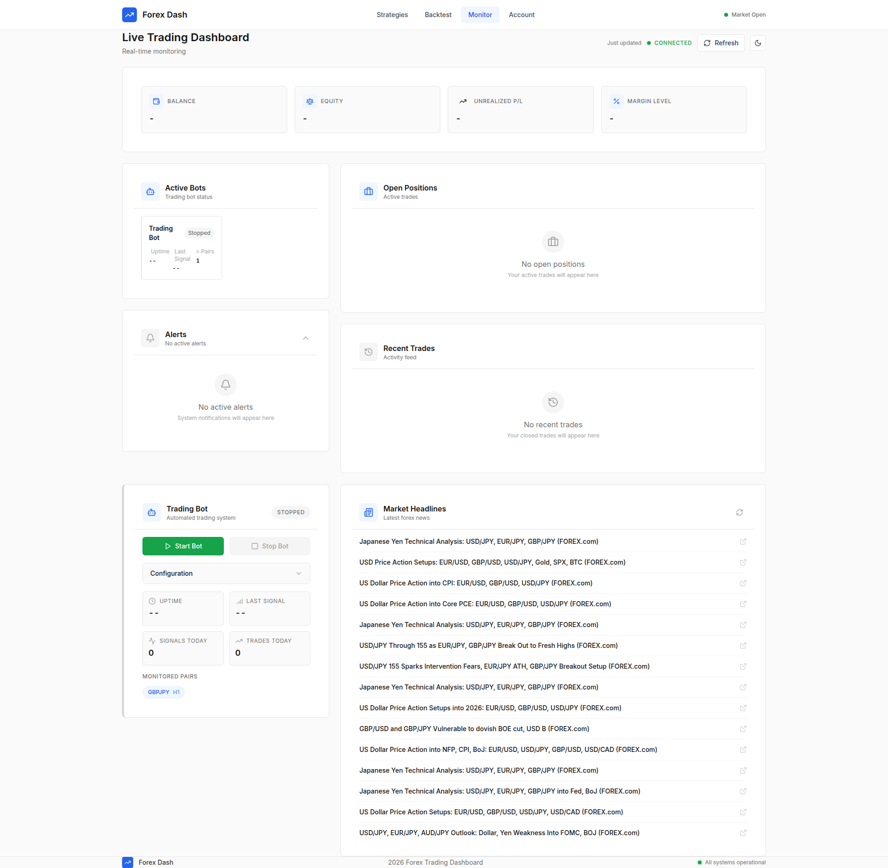
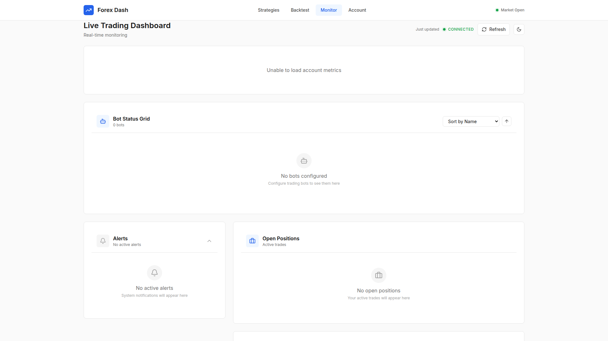

# Bot Status Grid

**ADW ID:** 4820fa15
**Date:** 2026-01-25
**Specification:** specs/issue-141-adw-4820fa15-sdlc_planner-view-bot-status-grid.md

## Overview

A comprehensive Bot Status Grid view for the Live Trading Dashboard that displays all trading bots in an interactive card-based grid layout. Each bot card shows real-time status information including name, operational status with color-coded indicators, currency pair, P/L, and open positions. The grid supports sorting, card expansion for details, and auto-refreshes every 5 seconds.

## Screenshots





## What Was Built

- **BotStatusGrid component**: Responsive grid layout with sorting controls and empty/loading states
- **BotCard component**: Individual bot cards with status badges, metrics, and expand/collapse functionality
- **Multi-bot backend support**: Extended BotStatusTracker to manage multiple bot instances
- **New API endpoint**: `/api/bots/status` returning all bot statuses with extended data
- **Data models**: BotInstance and AllBotsStatusResponse Pydantic models
- **Unit tests**: Comprehensive test coverage for multi-bot functionality

## Technical Implementation

### Files Modified

- `app/server/core/data_models.py`: Added BotInstance and AllBotsStatusResponse models
- `app/server/core/bot_status.py`: Extended BotStatusTracker with multi-bot methods
- `app/server/server.py`: Added GET /api/bots/status endpoint
- `app/client/src/app/api.js`: Added botsStatus endpoint
- `app/client/src/hooks/useDashboardData.js`: Updated polling interval to 5 seconds
- `app/client/src/pages/Monitor.jsx`: Integrated BotStatusGrid component
- `app/client/src/components/LiveDashboard/index.js`: Added component exports

### New Files

- `app/client/src/components/LiveDashboard/BotStatusGrid.jsx`: Grid container with sorting
- `app/client/src/components/LiveDashboard/BotCard.jsx`: Individual bot card component
- `app/server/tests/test_multi_bot_status.py`: Unit tests for multi-bot functionality
- `.claude/commands/e2e/test_bot_status_grid.md`: E2E test specification

### Key Changes

- **Status color coding**: Green (running), yellow (paused), gray (stopped), red (error) with animated pulse for running status
- **Sorting options**: Name (alphabetical), Status (priority), P/L (value), Last Activity (timestamp)
- **Responsive grid**: 1 column on mobile, 2 on tablet, 3 on desktop
- **Expandable cards**: Click to reveal strategy name, detailed position info, and error messages
- **5-second polling**: Dashboard data auto-refreshes every 5 seconds (reduced from 10)

## How to Use

1. Navigate to the **Monitor** page from the main navigation
2. View all trading bots in the Bot Status Grid section
3. Use the **Sort by** dropdown to change sort order (Name, Status, P/L, Last Activity)
4. Click the **arrow button** to toggle ascending/descending sort direction
5. Click any **bot card** to expand and view detailed information:
   - Strategy name
   - Position side and size
   - Entry price (if applicable)
   - Error message (for bots in error state)
6. The grid auto-refreshes every 5 seconds to show latest status

## Configuration

Bot instances are initialized from `app/bot/config/settings.json`. Each configured currency pair creates a bot instance. Demo bots are added when fewer than 3 pairs are configured.

### Bot Instance Fields

| Field | Type | Description |
|-------|------|-------------|
| id | string | Unique bot identifier (e.g., "bot_eurusd") |
| name | string | Display name (e.g., "EUR_USD Bot") |
| status | string | "running", "paused", "stopped", or "error" |
| currency_pair | string | Trading pair (e.g., "EURUSD") |
| current_pnl | float | Current profit/loss in account currency |
| open_position | object | Position details: side, amount, entry_price |
| last_activity | datetime | Last activity timestamp |
| strategy_name | string | Active strategy name |
| error_message | string | Error details if in error state |

## Testing

### Unit Tests

```bash
cd app/server && uv run pytest tests/test_multi_bot_status.py
```

### E2E Tests

Run the bot status grid E2E test:

```bash
# Read and execute .claude/commands/e2e/test_bot_status_grid.md
```

### Frontend Build

```bash
cd app/client && npm run build
```

## Notes

- The existing ActiveBotsGrid component is preserved for backward compatibility
- P/L values are formatted with USD currency symbol and color-coded (green positive, red negative)
- Position side is displayed as "LONG" or "SHORT" with appropriate color coding
- Future enhancements may include WebSocket support for real-time updates without polling
- Quick actions (start/stop/pause) can be added directly to grid cards in future iterations
