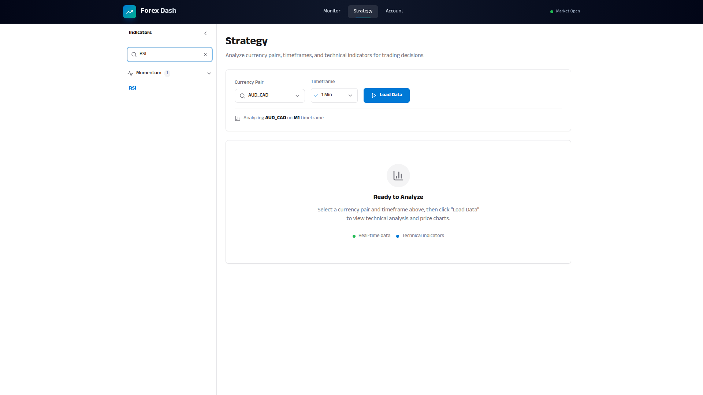
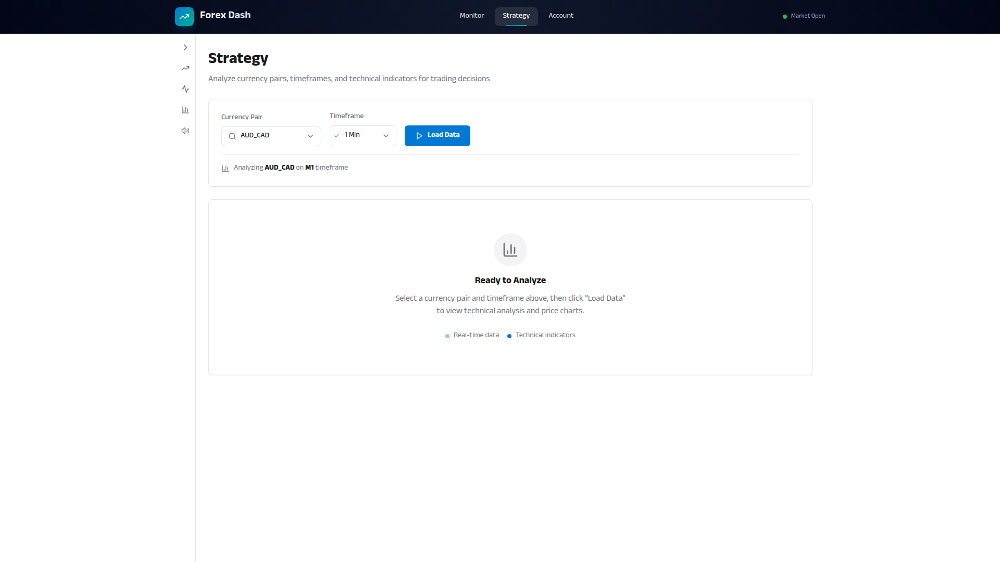
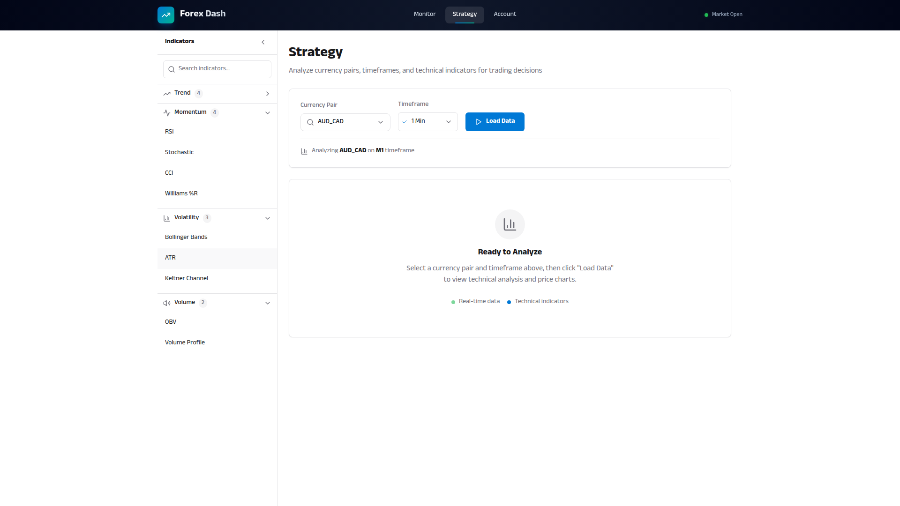

# Indicator Library Panel

**ADW ID:** 4f076469
**Date:** 2026-01-19
**Specification:** specs/issue-44-adw-4f076469-sdlc_planner-indicator-library-panel.md

## Overview

This feature implements a categorized indicator library panel as a collapsible left sidebar on the Strategy page. The panel provides traders with easy access to 13 technical analysis indicators organized by 5 categories (Trend, Momentum, Volatility, Volume, Custom), with real-time search filtering and smooth animations.

## Screenshots










## What Was Built

- Collapsible left sidebar panel integrated into the Strategy page layout
- Search input with real-time filtering across all categories
- Five collapsible category sections: Trend, Momentum, Volatility, Volume, Custom
- 13 technical indicators with icons, names, and tooltip descriptions
- Panel collapse/expand toggle to maximize chart space
- localStorage persistence for panel and category states
- Mobile-responsive design with 44px touch targets

## Technical Implementation

### Files Modified

- `app/client/src/pages/Strategy.jsx`: Integrated IndicatorLibrary into page layout with flex-based responsive grid
- `app/client/src/components/IndicatorLibrary.jsx`: New component (322 lines) implementing the full panel UI
- `app/client/src/app/indicators.js`: New data constants file (154 lines) with indicator definitions
- `.claude/commands/e2e/test_indicator_library_panel.md`: E2E test specification for the feature

### Key Changes

- Created `INDICATORS` array with 13 technical indicators containing id, name, shortName, category, and description fields
- Implemented search filtering using `useMemo` that matches against name, shortName, and description (case-insensitive)
- Added category expand/collapse with smooth CSS transitions (max-height animation, 150ms duration)
- Panel width transitions smoothly between 256px (expanded) and 40px (collapsed)
- localStorage persistence via `forex_dash_indicator_panel_collapsed` and `forex_dash_indicator_categories` keys

## How to Use

1. Navigate to the Strategy page from the navigation bar
2. The indicator library panel appears on the left side of the chart
3. Use the search bar at the top to filter indicators by name or description
4. Click on a category header to expand/collapse that section
5. Hover over any indicator to see its full name and description in a tooltip
6. Click the collapse button (left chevron) to minimize the panel and maximize chart space
7. Click the expand button (right chevron) on the collapsed bar to restore the panel

## Configuration

The following localStorage keys are used for persistence:

- `forex_dash_indicator_panel_collapsed`: Boolean for panel collapse state
- `forex_dash_indicator_categories`: JSON object for category expand/collapse states

## Testing

Run the E2E test to validate indicator library panel functionality:

```bash
# Read and execute the E2E test
# See .claude/commands/e2e/test_indicator_library_panel.md
```

The test validates:
- Panel visibility on Strategy page load
- Search functionality filtering indicators
- Category expand/collapse behavior
- Panel collapse/expand toggle
- Tooltip display on indicator hover

## Notes

- This is a **frontend-only** feature. The indicator library serves as a UI catalog for displaying available indicators.
- Future features will implement actual indicator calculation and chart overlay functionality.
- The Custom category is included but currently empty, reserved for future user-defined indicators.
- All indicators use Lucide React icons for consistent styling with the rest of the application.
