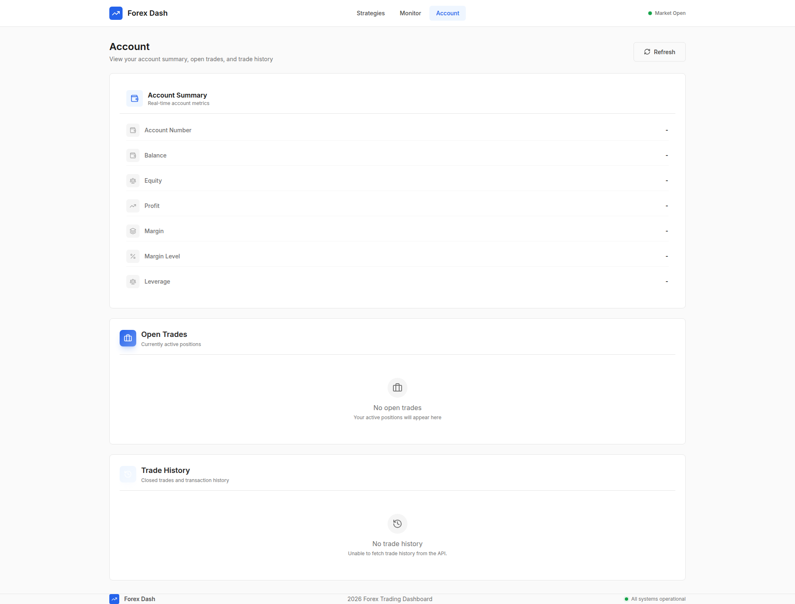
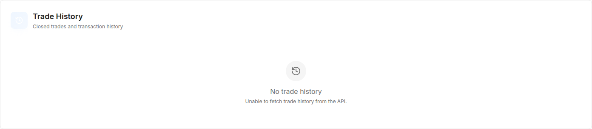

# Account Page Terminology Consistency

**ADW ID:** 5c1da8e9
**Date:** 2026-01-21
**Specification:** specs/issue-93-adw-5c1da8e9-sdlc_planner-rename-order-history-trade-history.md

## Overview

This bug fix ensures consistent trading terminology across the Account page by verifying that "Open Trades" and "Trade History" are used correctly in all UI text, component names, and labels. The implementation follows FXOpen API documentation standards where "trades" refer to executed transactions (filled orders that resulted in positions), not pending orders.

## Screenshots

## What Was Built

- E2E test specification for Account page terminology validation
- Test artifacts (screenshots and videos) demonstrating correct terminology usage
- Validation that all user-facing text uses "Open Trades" and "Trade History" (not "Order History")

## Technical Implementation

### Files Modified

- `.claude/commands/e2e/test_account_page_terminology.md`: New E2E test specification that validates correct terminology is displayed throughout the Account page
- `.mcp.json`: Updated configuration
- `playwright-mcp-config.json`: Updated Playwright configuration
- `.playwright-mcp/01_account_page_correct_terminology.png`: Screenshot showing correct terminology on Account page
- `.playwright-mcp/02_open_trades_section.png`: Screenshot of Open Trades section with correct terminology
- `.playwright-mcp/03_trade_history_section.png`: Screenshot of Trade History section with correct terminology
- `videos/29256c3d09d0f9c610cbce37e9631bbf.webm`: Test execution video
- `videos/58c87f2bc3119173b0a2fd76f87b2c1e.webm`: Test execution video

### Key Changes

- Created comprehensive E2E test that verifies "Open Trades" section header and subtitle ("Currently active positions")
- Validated "Trade History" section header (not "Order History") and subtitle ("Closed trades and transaction history")
- Verified empty states use correct terminology ("No open trades"/"Your active positions will appear here" and "No trade history"/"Your closed trades will appear here")
- Confirmed page description uses "open trades" and "trade history" terminology
- Ensured no instances of "Order History" appear anywhere on the Account page

## How to Use

### Running the E2E Test

1. Ensure the application is running (both frontend and backend)
2. Read `.claude/commands/test_e2e.md` for E2E test execution instructions
3. Execute the test defined in `.claude/commands/e2e/test_account_page_terminology.md`
4. Verify all success criteria are met:
   - Account page description uses "open trades" and "trade history" terminology
   - Open Trades section displays correct header and subtitle
   - Trade History section displays correct header and subtitle (not "Order History")
   - Empty states use correct terminology
   - No "Order History" references exist on the page

### Verifying Terminology in the UI

1. Navigate to http://localhost:3000/account
2. Check the Open Trades section header says "Open Trades"
3. Verify the subtitle reads "Currently active positions"
4. Check the Trade History section header says "Trade History" (not "Order History")
5. Verify the subtitle reads "Closed trades and transaction history"
6. If empty, verify empty state messages use correct terminology

## Configuration

No configuration changes required. The terminology is hardcoded in the UI components following trading industry standards.

## Testing

The E2E test specification validates:
- Correct section headers ("Open Trades" and "Trade History")
- Appropriate subtitles for each section
- Correct empty state messages
- Absence of "Order History" terminology
- Error states reference "Trade History" not "Order History"

Test artifacts include 3 screenshots documenting the correct terminology throughout the page.

## Notes

### Terminology Standards

From FXOpen Web API Documentation and trading industry standards:
- **Orders**: Instructions to buy/sell (can be pending, cancelled, or executed)
- **Trades**: Executed transactions (filled orders that resulted in positions)

Therefore:
- "Open Trades" = Currently active positions
- "Trade History" = Historical executed trades (from POST /api/v2/tradehistory endpoint)

### Previous Related Work

- Feature bfd1a7d1: Initial Account page implementation with OpenTrades and TradeHistory components
- Feature bbdb5a41: Renamed OrderHistory.jsx to TradeHistory.jsx and updated imports

This bug fix verifies that the terminology is fully consistent throughout all user-facing text and provides automated testing to prevent regressions.

### Design Consistency

All components follow the Precision Swiss Design System:
- Card titles use `.card-title` class with font-weight-600
- Card subtitles use `.text-xs` and `.text-muted-foreground`
- Empty states include icon, primary message, and secondary descriptive text
