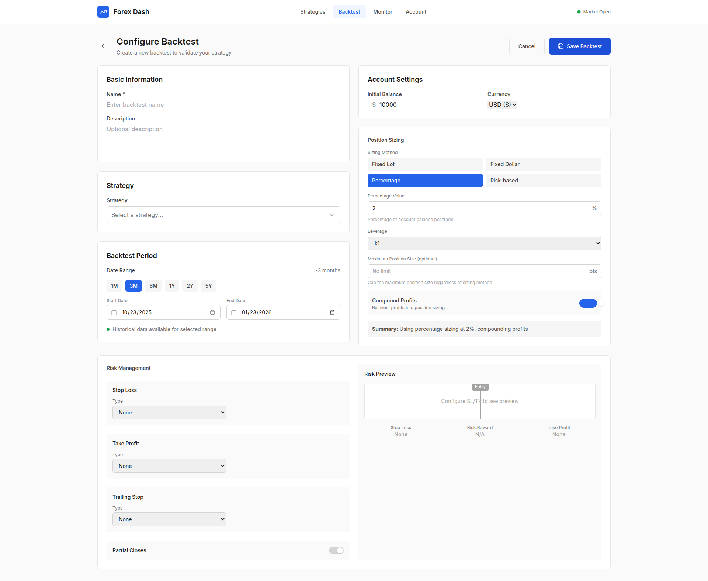

# Backtest Configuration Components Cleanup

**ADW ID:** 60248bd3
**Date:** 2026-01-23
**Specification:** specs/issue-118-adw-60248bd3-sdlc_planner-backtest-configuration-components.md

## Overview

This chore involved verifying and documenting the existing backtest configuration feature architecture. The investigation confirmed that BacktestConfiguration (full-page form) and BacktestLibrary (grid-based library) components are properly integrated with routing, navigation, and workflow. Screenshots were captured to document the current implementation for reference.

## Screenshots

*Backtest Library page showing grid layout with backtest cards*

*Backtest Configuration page for creating new backtests*

*Backtest Configuration page in edit mode for existing backtests*

## What Was Built

This was a verification chore rather than a feature implementation. The following was documented:

- Verified BacktestConfiguration page exists at `app/client/src/pages/BacktestConfiguration.jsx` (full-page form, not a dialog)
- Verified BacktestLibrary page exists at `app/client/src/pages/BacktestLibrary.jsx` (serves as the backtest dashboard)
- Confirmed App.jsx routes are properly configured for `/backtests`, `/backtests/new`, and `/backtests/:id/edit`
- Verified NavigationBar includes "Backtest" navigation item pointing to `/backtests`
- Updated configuration files with current worktree path
- Captured screenshots documenting the UI components

## Technical Implementation

### Files Modified

- `.mcp.json`: Updated worktree path from `f58bdd9c` to `60248bd3`
- `playwright-mcp-config.json`: Updated video recording directory path to current worktree
- `.playwright-mcp/01_backtest_library_page.png`: Screenshot of backtest library page
- `.playwright-mcp/02_backtest_configuration_page.png`: Screenshot of configuration page
- `.playwright-mcp/03_backtest_configuration_edit_mode.png`: Screenshot of edit mode
- `specs/issue-118-adw-60248bd3-sdlc_planner-backtest-configuration-components.md`: Created specification documenting the verification tasks

### Key Changes

- Configuration files updated to reference current worktree (`60248bd3`)
- Screenshots captured showing the complete backtest workflow
- Specification created documenting the architecture decisions:
  - BacktestConfiguration is a full-page component, not a dialog
  - BacktestLibrary serves as the dashboard (no separate BacktestDashboard exists)
  - Architecture follows the same pattern as Strategies feature

## How to Use

The backtest configuration workflow follows this navigation flow:

1. Click "Backtest" in the NavigationBar to go to `/backtests` (BacktestLibrary page)
2. Click "New Backtest" button in BacktestLibrary to navigate to `/backtests/new` (BacktestConfiguration page)
3. Fill out the backtest configuration form with:
   - Strategy selection
   - Date range
   - Position sizing
   - Risk management settings
4. Click "Save" to create the backtest and return to BacktestLibrary
5. To edit an existing backtest, click a backtest card in BacktestLibrary to navigate to `/backtests/:id/edit`
6. Use "Back" or "Cancel" buttons to return to BacktestLibrary from BacktestConfiguration

## Configuration

The backtest configuration feature requires:

- Routes in `App.jsx` for `/backtests`, `/backtests/new`, and `/backtests/:id/edit`
- Navigation item in NavigationBar pointing to `/backtests`
- BacktestLibrary component for listing backtests
- BacktestConfiguration component for creating/editing backtests

All configuration is already properly set up in the codebase.

## Testing

To test the backtest configuration workflow:

1. Navigate to the home page
2. Click "Backtest" in the navigation bar
3. Verify BacktestLibrary page loads with grid layout
4. Click "New Backtest" button
5. Verify BacktestConfiguration page loads
6. Verify all form fields are present (strategy selector, date range, position sizing, risk management)
7. Test navigation back to BacktestLibrary using "Back" or "Cancel" buttons
8. Test editing an existing backtest by clicking a backtest card

## Notes

- This was a verification chore, not a feature implementation - no code changes were required
- The issue referenced potentially missing components (BacktestConfigurationDialog, BacktestDashboard) that don't exist by design
- Architecture decision: BacktestConfiguration is a full page rather than a dialog component for better user experience with complex forms
- Architecture decision: BacktestLibrary serves as the dashboard, no separate BacktestDashboard page exists
- The backtest feature follows the same architectural pattern as the Strategies feature (StrategyLibrary + Strategy)
- Screenshots captured for documentation purposes show the current UI implementation
- Configuration file paths updated to reflect current worktree location
