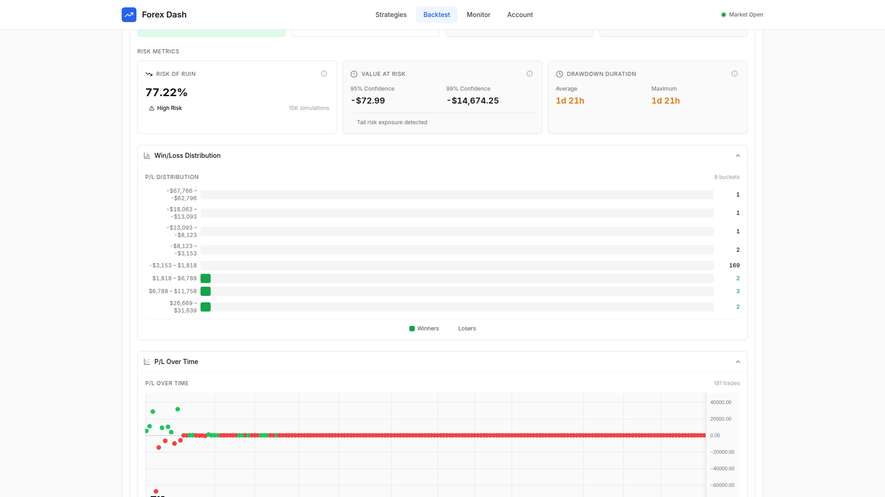

# Risk Analytics

**ADW ID:** 64cbfa24
**Date:** 2026-01-24
**Specification:** specs/issue-133-adw-64cbfa24-sdlc_planner-view-risk-analytics.md

## Overview

This feature adds a comprehensive Risk Analytics section to the Backtest Results Summary page. It provides detailed risk metrics and visualizations including streak analysis, Value at Risk (VaR), Risk of Ruin calculations, drawdown duration analysis, and distribution histograms to help traders understand the risk profile of their trading strategies.

## Screenshots





## What Was Built

- **Streak Analysis**: Maximum and average consecutive wins/losses tracking
- **Value at Risk (VaR)**: VaR calculations at 95% and 99% confidence levels using historical simulation
- **Risk of Ruin Calculator**: Monte Carlo simulation-based probability of account ruin (10,000 iterations)
- **Drawdown Duration Analysis**: Average and maximum drawdown duration statistics
- **Win/Loss Distribution Histogram**: Visual distribution of trade P/L values with color coding
- **P/L Scatter Plot**: Entry time vs P/L scatter plot to identify time-based patterns
- **Holding Period Distribution**: Histogram showing distribution of trade durations
- **Collapsible UI**: All sections are collapsible following existing design patterns

## Technical Implementation

### Files Modified

- `app/server/core/data_models.py`: Extended BacktestResultsSummary model with 13 new fields for risk analytics data
- `app/server/core/backtest_executor.py`: Added 7 new calculation methods for risk metrics (+470 lines)
- `app/client/src/components/BacktestResultsSummary.jsx`: Integrated RiskAnalytics component
- `app/client/src/app/metricDefinitions.js`: Added metric definitions for new risk metrics

### New Files Created

- `app/client/src/components/RiskAnalytics.jsx`: Parent component for risk analytics section
- `app/client/src/components/WinLossHistogram.jsx`: Histogram for P/L distribution
- `app/client/src/components/PLScatterPlot.jsx`: Scatter plot for entry time vs P/L
- `app/client/src/components/HoldingPeriodHistogram.jsx`: Histogram for holding period distribution
- `app/client/src/components/RiskOfRuinCard.jsx`: Monte Carlo risk of ruin display
- `app/client/src/components/DrawdownDurationCard.jsx`: Drawdown duration statistics
- `app/client/src/components/VaRCard.jsx`: Value at Risk display
- `app/server/tests/test_backtest_executor.py`: Unit tests for calculation methods
- `.claude/commands/e2e/test_risk_analytics.md`: E2E test specification

### Key Changes

- **Backend Calculations**: Seven new methods in `backtest_executor.py`:
  - `_calculate_consecutive_streaks()`: Tracks win/loss streaks iterating through trades
  - `_calculate_win_loss_distribution()`: Creates histogram buckets for P/L values (20 buckets default)
  - `_calculate_holding_period_distribution()`: Creates histogram for trade durations (15 buckets default)
  - `_calculate_pl_scatter_data()`: Extracts entry_time and pnl for scatter visualization
  - `_calculate_risk_of_ruin()`: Monte Carlo simulation (10,000 iterations) resampling trade returns
  - `_calculate_drawdown_durations()`: Analyzes equity curve for drawdown period durations
  - `_calculate_var()`: Historical VaR calculation at 95% and 99% confidence levels

- **Data Model Extensions**: New fields in BacktestResultsSummary including `max_consecutive_wins`, `max_consecutive_losses`, `avg_consecutive_wins`, `avg_consecutive_losses`, `win_loss_distribution`, `holding_period_distribution`, `pl_scatter_data`, `risk_of_ruin`, `risk_of_ruin_simulations`, `drawdown_durations`, `avg_drawdown_duration_minutes`, `max_drawdown_duration_minutes`, `var_95`, `var_99`

- **Frontend Components**: All visualizations use Plotly.js for consistency with existing charts. Components handle null/missing data gracefully with appropriate fallback messages.

## How to Use

1. Run a backtest on any strategy with at least 5 trades
2. Navigate to the Backtest Results page after completion
3. Scroll down to find the "Risk Analytics" section (collapsed by default)
4. Click on the section header to expand it
5. View streak analysis metrics (max/avg consecutive wins/losses)
6. Review Risk Metrics cards showing Risk of Ruin, VaR, and Drawdown Duration
7. Expand/collapse individual chart sections (Win/Loss Distribution, P/L Over Time, Holding Period)
8. Hover over chart elements to see detailed tooltips

## Configuration

No additional configuration required. Risk analytics are automatically calculated during backtest execution and stored with the results.

**Default Settings:**
- Monte Carlo simulations: 10,000 iterations
- Ruin threshold: 50% of account
- Histogram buckets: 20 for P/L distribution, 15 for holding period
- VaR confidence levels: 95% and 99%

## Testing

**Backend Unit Tests:**
```bash
cd app/server && uv run pytest tests/test_backtest_executor.py -v
```

**Frontend Build:**
```bash
cd app/client && npm run build
```

**E2E Test:**
Execute `.claude/commands/e2e/test_risk_analytics.md` following the test_e2e.md instructions.

## Notes

- Risk analytics require at least 5 trades to calculate Risk of Ruin (Monte Carlo needs sufficient data)
- VaR uses historical simulation method (sorting actual P/L values) which works well with trade data
- All calculations are performed server-side during backtest completion for efficient retrieval
- Chart styling follows the Precision Swiss Design System for visual consistency
- The section gracefully hides if no risk analytics data is available
