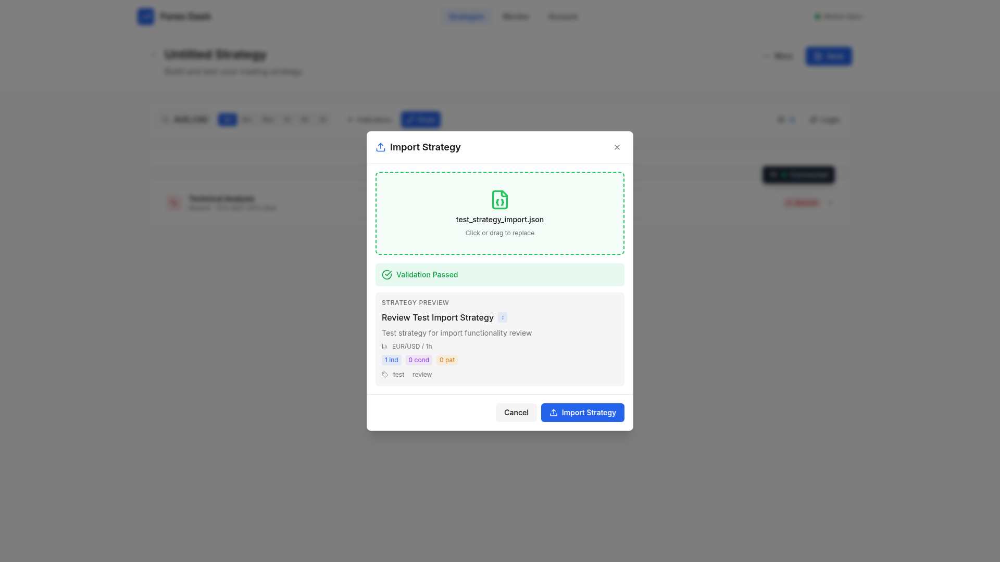

# Strategy Import and Pattern Display Bug Fixes

**ADW ID:** 8047b9ec
**Date:** 2026-01-21
**Specification:** specs/issue-91-adw-8047b9ec-sdlc_planner-strategy-import-pattern-display.md

## Overview

Fixed four interconnected bugs in the Strategy Builder that broke critical strategy management workflows: import not refreshing UI, poor error handling during strategy loading, potential export data corruption, and patterns failing to display on charts. These fixes ensure strategies can be imported and immediately viewed, errors provide actionable feedback, exports maintain data integrity, and patterns render consistently with user feedback.

## Screenshots

### Strategy Import Flow

*Import strategy dialog for uploading strategy JSON files*

*Preview panel showing strategy configuration before import*

*Successful validation with immediate UI load after import*

### Pattern Display on Chart

*Pattern markers successfully rendering on candlestick chart*

*Doji pattern displayed with proper color-coded markers*

## What Was Built

- **Auto-Load on Import**: Imported strategies now automatically load into the UI, eliminating manual load step
- **Enhanced Error Handling**: Strategy load failures now provide specific, actionable error messages (database connection, missing indicators, network issues)
- **Pattern User Feedback**: Users receive immediate feedback when patterns are detected or not found in price data
- **Pattern Type Validation**: Ensures patternType property is preserved for correct marker coloring
- **Chart Type Support**: Removed restrictive chart type check that prevented patterns from rendering
- **Backend Validation Fix**: Updated StrategyConfig.candle_count to accept both int and str types for flexibility

## Technical Implementation

### Files Modified

- `app/client/src/pages/Strategy.jsx`: Core strategy management logic
  - Lines 922-950: Added pattern detection feedback and explicit patternType assignment
  - Lines 1798-1907: Enhanced error handling with specific validation for indicators, patterns, conditions, and groups
  - Lines 2135-2145: Auto-load imported strategy after successful import

- `app/client/src/app/chart.js`: Chart rendering and pattern marker creation
  - Lines 633-691: Added logging and patternType validation in createPatternMarkers
  - Lines 888-891: Removed chart type restriction for pattern rendering

- `app/server/core/data_models.py`: Backend data model validation
  - Line 394: Updated StrategyConfig.candle_count to Union[int, str, None] for flexible type handling

- `app/server/tests/core/test_data_models.py`: Added tests for candle_count validation

### Key Changes

1. **Import Auto-Load**: After successful strategy import, the frontend now calls `handleLoadStrategy()` with the returned `strategy_id` to immediately populate the UI with indicators, conditions, and patterns.

2. **Error Context**: Load failures now check for specific error types (Supabase/database, not found, network) and display targeted messages like "Database connection failed. Please check your Supabase configuration."

3. **Pattern Feedback**: When dragging patterns to the chart, users see success messages ("Found 3 Hammer pattern(s)") or informational messages ("No Hammer patterns detected in current price data. Try loading more candles or a different timeframe.").

4. **Pattern Type Preservation**: Pattern creation now explicitly retrieves the pattern definition from PATTERNS and sets `patternType: patternDef?.patternType || pattern.patternType || 'neutral'` to ensure proper marker colors (green for bullish, red for bearish, gray for neutral).

5. **Debug Logging**: Added console logs throughout pattern marker creation to aid debugging: "createPatternMarkers called with X patterns", "Generated Y markers", "Markers successfully set on chart".

## How to Use

### Importing a Strategy

1. Navigate to Strategy Builder page
2. Click the "Import Strategy" button in the toolbar
3. Select a valid strategy JSON file
4. View the preview panel to verify configuration
5. Click "Import" - the strategy will automatically load into the UI
6. All indicators, conditions, and patterns are immediately visible

### Understanding Load Errors

When a strategy fails to load, error messages now tell you exactly what went wrong:

- **"Database connection failed. Please check your Supabase configuration."** - Supabase service is unreachable
- **"Strategy contains unknown indicators: [list]. Please update your indicator library."** - Strategy references indicators not in your INDICATORS definition
- **"Strategy not found. It may have been deleted."** - Invalid strategy ID or deleted strategy
- **"Failed to restore [indicators/patterns/conditions/groups]: [error]"** - Specific component restoration failure

### Using Patterns

1. Load price data with sufficient candles (100+ recommended)
2. Ensure chart is in candlestick mode (patterns work on all chart types now)
3. Drag a pattern (e.g., "Hammer") from the Indicator Library to the chart
4. View feedback message:
   - Success: "Found 3 Hammer pattern(s)" with green markers on chart
   - Info: "No Hammer patterns detected in current price data. Try loading more candles or a different timeframe."
5. Pattern markers are color-coded:
   - Green: Bullish patterns
   - Red: Bearish patterns
   - Gray: Neutral patterns

## Configuration

No additional configuration required. This feature uses existing:

- Toast notification system (showSuccess, showError, showInfo)
- PATTERNS definition from `app/client/src/app/patterns.js`
- Strategy service endpoints in `app/server/core/strategy_service.py`

## Testing

### Manual Testing

1. **Import Flow**: Import a strategy JSON file and verify UI immediately shows all components without manual load
2. **Error Handling**: Stop Supabase service, attempt to load a strategy, verify specific error message appears
3. **Pattern Feedback**: Drag pattern to chart with data containing patterns (verify success + markers) and without patterns (verify info message)
4. **Pattern Colors**: Verify bullish patterns show green markers, bearish show red, neutral show gray

### Automated Testing

- E2E test specification: `.claude/commands/e2e/test_strategy_import_pattern.md`
- Backend tests: `app/server/tests/core/test_data_models.py` validates candle_count type flexibility
- Run server tests: `cd app/server && uv run pytest`
- Run frontend build: `cd app/client && npm run build`

## Notes

### Known Limitations

- Pattern detection requires sufficient price data; too few candles may result in zero patterns found
- Patterns work on all chart types but markers are most visible on candlestick charts
- Import requires backend to return `strategy_id` in response (implemented in this fix)

### Performance Considerations

- Import auto-load adds one additional API call but significantly improves UX
- Pattern detection feedback is non-blocking and doesn't affect workflow
- Error validation checks add minimal overhead (< 10ms per check)

### Backwards Compatibility

- Existing strategies remain compatible; no schema changes
- Error messages are additive improvements, don't break success paths
- Pattern display changes are non-breaking (additional logging and feedback)

### Future Improvements

- Consider showing loading spinner during import auto-load
- Add retry mechanism for transient network errors
- Implement pattern detection confidence scores in UI
- Cache pattern detection results to improve performance on re-renders
