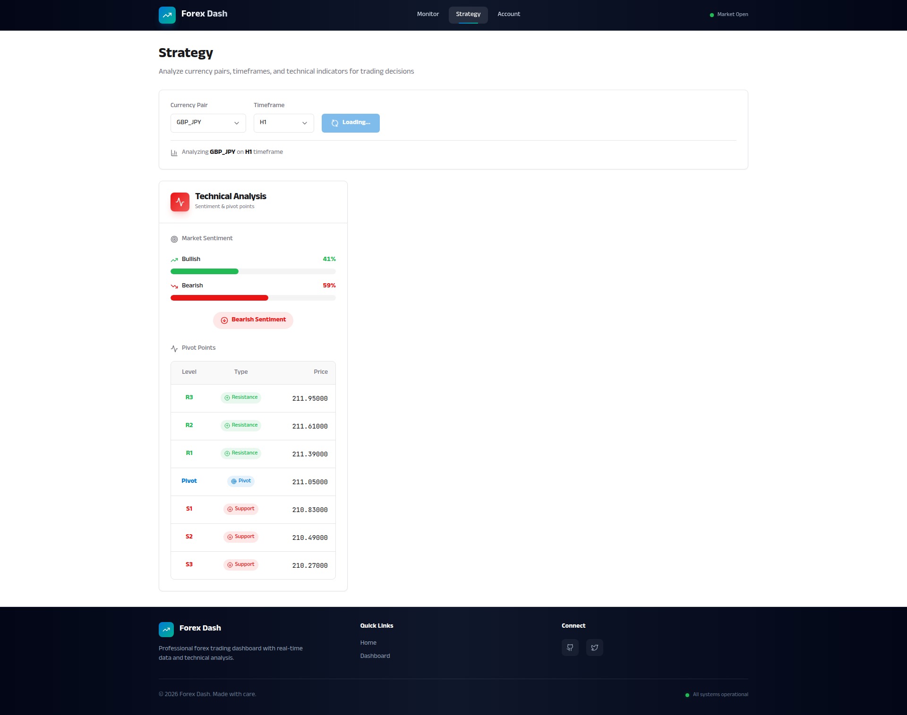

# Chart Zoom and Scroll Controls for Enhanced Navigation

**ADW ID:** 947a25d2
**Date:** 2026-01-19
**Specification:** specs/issue-34-adw-947a25d2-sdlc_planner-chart-zoom-scroll-controls.md

## Overview

This feature enhances the PriceChart.jsx component with comprehensive zoom and scroll interactions, enabling forex traders to navigate through historical price data at varying detail levels. Traders can use mouse wheel zoom, click-drag panning, keyboard shortcuts, and touch gestures to explore candlestick data with precision, complete with smart zoom constraints (50-500 candles visible), cursor-centered zooming, and visual feedback.

## Screenshots


*Chart on initial load with interaction hints tooltip*


*Chart with zoom level indicator showing visible candle count*

## What Was Built

- **Zoom Constraint System**: Enforces minimum 50 and maximum 500 candles visible to maintain optimal chart readability
- **Keyboard Navigation**: Implements +/- for zooming (20% increments) and arrow keys for scrolling (10% of visible range)
- **Zoom Level Indicator**: Real-time display of visible candle count below the chart
- **Interaction Hints Tooltip**: Context-aware tooltip showing available controls (different hints for touch vs desktop)
- **Cursor-Centered Zooming**: Chart zooms toward the price point under the cursor for intuitive navigation
- **Boundary Constraints**: Prevents scrolling beyond available data range (first to last candle)
- **Focus Management**: Keyboard shortcuts only activate when appropriate (not when typing in inputs)
- **Touch Device Support**: Automatic detection and appropriate hint display for mobile/tablet users
- **Performance Optimization**: requestAnimationFrame for smooth 60fps interactions and transitions

## Technical Implementation

### Files Modified

- `app/client/src/app/chart.js`: Added zoom constraint utilities and event handling
  - Implemented `getVisibleCandleCount()` to calculate visible candles from X-axis range
  - Implemented `clampZoomRange()` to enforce 50-500 candle constraints
  - Implemented `computeZoomedInRange()`, `computeZoomedOutRange()`, and `computeScrolledRange()` for keyboard navigation
  - Added `plotly_relayout` event listener to enforce zoom constraints and dispatch custom events
  - Added data boundary checking to prevent scrolling beyond available data
  - Total additions: 207 lines

- `app/client/src/components/PriceChart.jsx`: Enhanced React component with interaction features
  - Added React hooks: `chartRef`, `visibleCandleCount`, `showInteractionHint`, `isTouchDevice`
  - Implemented touch device detection via `'ontouchstart' in window`
  - Added keyboard event listener with focus management (prevents interference with inputs)
  - Created zoom level indicator UI component displaying "Showing X candles"
  - Created interaction hints tooltip with localStorage-based dismissal
  - Integrated custom `chartZoomUpdate` event listener to sync UI with zoom state
  - Total additions: 191 lines

- `.claude/commands/e2e/test_chart_zoom_scroll.md`: New E2E test specification (344 lines)
  - Comprehensive test coverage for all zoom/scroll interactions
  - Validates zoom constraints, boundary detection, keyboard shortcuts, and visual feedback

### Key Changes

1. **Zoom Constraint Enforcement**: plotly_relayout event handler intercepts zoom/pan operations and uses `clampZoomRange()` to prevent zooming beyond 50-500 candle limits. Uses requestAnimationFrame to debounce and prevent layout thrashing.

2. **Keyboard Navigation System**: useEffect hook with focus management checks if active element is INPUT/TEXTAREA/SELECT before processing keys. Prevents shortcuts from triggering while typing in form fields.

3. **Custom Event Communication**: chart.js dispatches `chartZoomUpdate` custom events containing `visibleCandleCount`, which PriceChart.jsx listens to for updating the zoom level indicator in real-time.

4. **Smooth Transitions**: All keyboard-triggered zoom/scroll operations wrapped in requestAnimationFrame and use Plotly's transition option with 150ms duration for fluid animations.

5. **Boundary-Aware Scrolling**: `computeScrolledRange()` enforces data boundaries by checking against first/last candle timestamps and preventing overflow shifts.

## How to Use

### Mouse Interactions

1. **Zoom In/Out**: Scroll mouse wheel up to zoom in, down to zoom out
   - Chart zooms toward the position of your cursor for intuitive navigation
   - Zoom is automatically constrained between 50-500 visible candles

2. **Pan Left/Right**: Click and drag on the chart to pan through historical data
   - Cannot scroll beyond the first or last candle in the dataset

3. **Reset Zoom**: Double-click anywhere on the chart to reset to full autorange view

### Keyboard Shortcuts

1. **Zoom In**: Press `+` or `=` to zoom in by 20%
2. **Zoom Out**: Press `-` to zoom out by 20%
3. **Scroll Left**: Press `←` (left arrow) to scroll left by 10% of visible range
4. **Scroll Right**: Press `→` (right arrow) to scroll right by 10% of visible range

**Note**: Keyboard shortcuts only work when you're not typing in an input field or dropdown.

### Touch Devices (Mobile/Tablet)

1. **Zoom**: Use pinch gesture to zoom in/out
2. **Pan**: Touch and drag to pan through data
3. **Reset**: Double-tap to reset to full view

### Visual Feedback

- **Zoom Level Indicator**: Below the chart, you'll see "Showing X candles" that updates in real-time as you zoom/pan
- **Interaction Hints**: On first visit, a tooltip appears explaining available controls. Click the X button to dismiss permanently.

## Configuration

No configuration required. The feature works out-of-the-box with these defaults:

- **Minimum visible candles**: 50 (automatically adjusted if dataset has fewer candles)
- **Maximum visible candles**: 500
- **Zoom increment**: 20% per keyboard action
- **Scroll increment**: 10% of visible range per keyboard action
- **Transition duration**: 150ms for smooth animations
- **Hint dismissal**: Stored in browser localStorage as `chart-interaction-hint-dismissed`

## Testing

### Manual Testing

1. Navigate to the Strategy page and load chart data
2. Test mouse wheel zoom and verify the zoom level indicator updates
3. Try zooming beyond limits (50 min, 500 max) and confirm constraints are enforced
4. Test keyboard shortcuts (+/-, arrow keys) for zoom and scroll
5. Click into a dropdown and press + to verify it doesn't zoom (focus management)
6. Test panning and verify you cannot scroll beyond data boundaries
7. Double-click to reset and verify chart returns to full view

### E2E Testing

Run the comprehensive E2E test specification:
- Execute `.claude/commands/e2e/test_chart_zoom_scroll.md`
- Validates all zoom/scroll interactions, constraints, keyboard shortcuts, and visual feedback

### Validation Commands

```bash
# Run server tests (ensure no regressions)
cd app/server && uv run pytest

# Run client build (ensure no build errors)
cd app/client && npm run build
```

## Notes

### Performance Characteristics

- Uses `requestAnimationFrame` for all keyboard-triggered operations to maintain 60fps
- Plotly automatically switches to WebGL rendering (scattergl) for datasets with 500+ candles
- Event listeners are properly cleaned up in useEffect to prevent memory leaks
- Debounced relayout handling prevents infinite loop scenarios

### Browser Compatibility

- Touch detection works on all modern browsers via `'ontouchstart' in window`
- WebGL fallback to SVG on older browsers (may impact performance with 500+ candles)
- localStorage used for hint dismissal (gracefully degrades if disabled)

### Limitations

- If dataset has fewer than 50 candles, the minimum constraint is not enforced (all candles shown)
- Keyboard shortcuts may conflict with browser/OS shortcuts (e.g., browser zoom) - users can use mouse instead
- Touch device detection is simple and may not perfectly distinguish hybrid devices

### UI Style Guide Compliance

All UI elements follow `ai_docs/ui_style_guide.md`:
- Zoom level indicator: `text-sm text-muted-foreground font-medium`
- Interaction hints tooltip: `bg-black/90 text-white rounded-md px-4 py-3 shadow-lg`
- Spacing: `mt-2` (8px gap) between chart and zoom indicator per 4px base unit
- Animation: `animate-fade-in` for tooltip appearance

### Future Enhancements

Potential features for future iterations:
- Zoom history with back/forward navigation
- Mini-map navigator showing current visible range
- Zoom presets (e.g., "1 hour", "4 hours", "1 day" buttons)
- Synchronized zoom across multiple charts
- API-triggered data loading when zooming beyond current dataset
