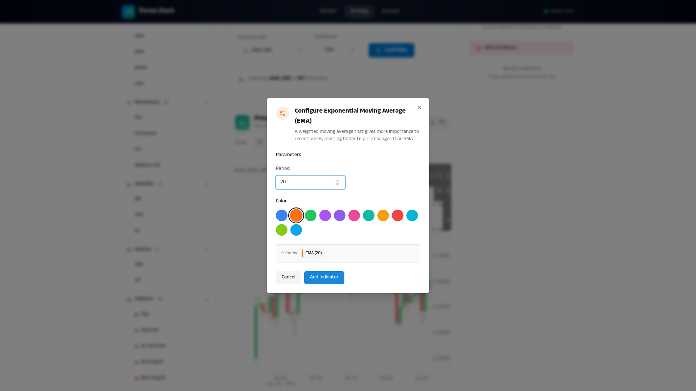
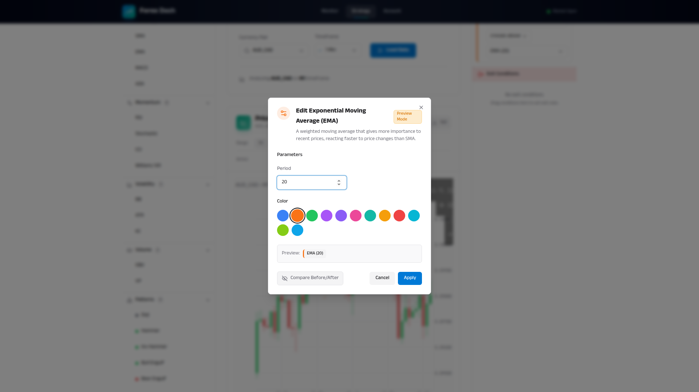
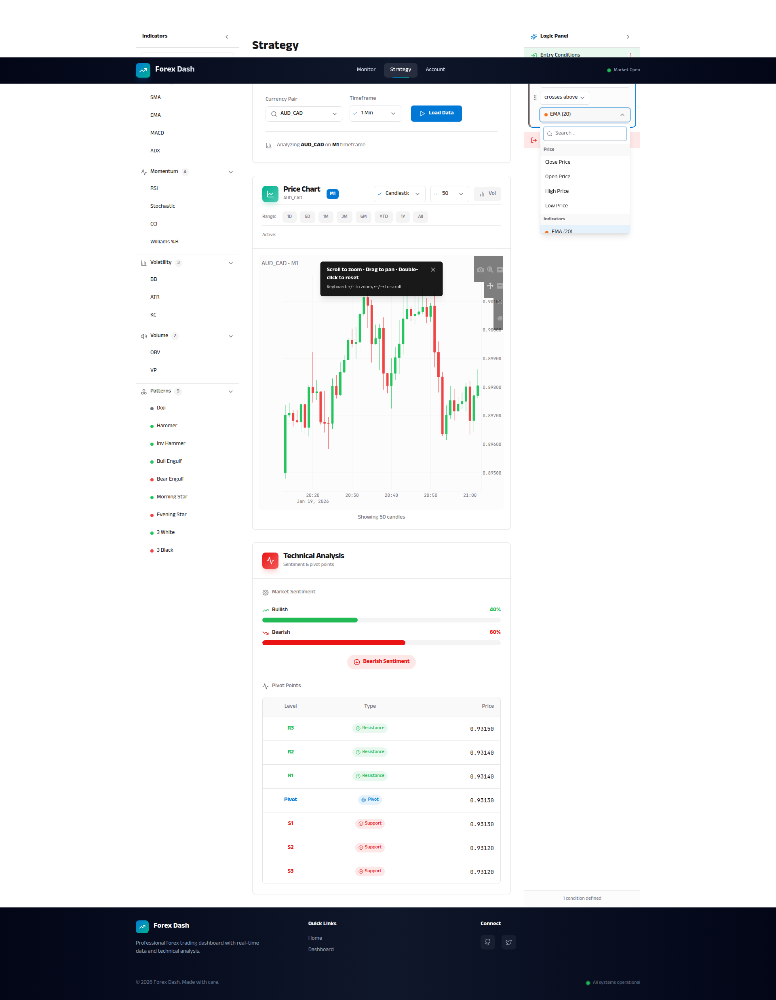

# Real-Time Parameter Adjustment Preview

**ADW ID:** a5444a1e
**Date:** 2026-01-19
**Specification:** specs/issue-58-adw-a5444a1e-sdlc_planner-realtime-parameter-preview.md

## Overview

This feature adds TradingView-like real-time preview capabilities to indicator settings, allowing traders to instantly see parameter changes rendered on the chart before committing them. When adjusting indicator parameters (period, standard deviation, color) in the settings dialog, a preview indicator with dashed lines and reduced opacity appears on the chart, enabling visual fine-tuning of settings. The implementation includes debounced recalculation (200ms), performance monitoring, and side-by-side before/after comparison mode.

## Screenshots


*Initial EMA indicator settings dialog with period 20*


*EMA indicator added to the chart*


*Edit dialog showing preview mode active*


*Real-time preview showing EMA with period adjusted to 50 (dashed line)*


*Final chart view with applied EMA indicator*

## What Was Built

- **Real-time Preview System**: Live indicator rendering with parameter changes debounced at 200ms
- **Preview Visual Styling**: Dashed lines with 0.6 opacity to distinguish preview from committed indicators
- **Performance Monitoring**: Real-time calculation time tracking with visual feedback (green/yellow/red)
- **Side-by-Side Comparison**: Toggle to view both original and preview indicators simultaneously
- **Custom React Hooks**: `useDebounce` and `usePerformanceMonitor` for reusable functionality
- **Apply/Cancel Logic**: Commit preview changes or revert to original settings
- **Chart Constants**: Centralized preview styling and performance threshold constants
- **E2E Test Suite**: Comprehensive Playwright test validating all preview functionality

## Technical Implementation

### Files Modified

- `app/client/src/components/IndicatorSettingsDialog.jsx`: Enhanced with real-time preview triggers, debounced parameter updates, performance indicators, and comparison mode toggle
- `app/client/src/pages/Strategy.jsx`: Added `previewIndicator` and `comparisonMode` state management with handlers for preview updates, apply, and cancel operations
- `app/client/src/components/PriceChart.jsx`: Modified to render preview indicators with special styling and support comparison mode showing both original and preview side-by-side
- `app/client/src/app/chart.js`: Added `applyPreviewStyling()` function and updated all indicator trace creation to support preview mode with dashed lines and reduced opacity
- `app/client/src/hooks/useDebounce.js`: New custom hook implementing 200ms debouncing to prevent excessive recalculations during rapid parameter changes
- `app/client/src/hooks/usePerformanceMonitor.js`: New custom hook for tracking calculation performance with start/stop timers
- `app/client/src/app/chartConstants.js`: New file defining preview styling constants (`PREVIEW_LINE_DASH`, `PREVIEW_OPACITY`, `PREVIEW_LABEL_SUFFIX`) and performance thresholds

### Key Changes

1. **Preview Layer Architecture**: Indicators now support an `isPreview` flag that triggers dashed line styling and reduced opacity (0.6) when rendering, creating a clear visual distinction between committed and preview indicators.

2. **Debounced Recalculation**: The `useDebounce` hook batches rapid parameter adjustments with a 200ms delay, preventing excessive calculations while maintaining responsive UI feedback.

3. **Performance Tracking**: Real-time performance monitoring displays calculation time in the dialog footer with color-coded feedback (green < 200ms, yellow 200-500ms, red > 500ms).

4. **State Management**: Strategy page maintains separate `previewIndicator` state alongside `activeIndicators`, allowing seamless preview without affecting committed indicators until user clicks Apply.

5. **Chart Rendering Logic**: The `applyPreviewStyling()` function in chart.js uniformly applies preview styling to all indicator types (overlay and subchart), ensuring consistent visual treatment.

## How to Use

1. **Add an Indicator**: Navigate to the Strategy page and add any indicator (e.g., EMA) to the chart
2. **Enter Edit Mode**: Click on the indicator badge or line on the chart to open the settings dialog in edit mode
3. **Adjust Parameters**: Use sliders or input fields to change indicator parameters (e.g., period from 20 to 50)
4. **View Preview**: The chart instantly updates with a dashed, semi-transparent preview indicator showing the new parameters
5. **Compare Before/After**: Toggle the comparison mode button to see both original and preview indicators side-by-side
6. **Monitor Performance**: Check the dialog footer for calculation time (displays "Updated in Xms")
7. **Apply or Cancel**: Click "Apply" to commit changes or "Cancel" to revert to original settings
8. **Keyboard Shortcuts**: Press Enter to apply or Escape to cancel (when dialog is focused)

## Configuration

### Preview Styling Constants

Defined in `app/client/src/app/chartConstants.js`:

```javascript
PREVIEW_LINE_DASH = 'dash'          // Dashed line style
PREVIEW_OPACITY = 0.6               // 60% opacity
PREVIEW_LABEL_SUFFIX = ' (Preview)' // Name suffix
```

### Performance Thresholds

```javascript
PERFORMANCE_THRESHOLD_GOOD = 200ms     // Green indicator
PERFORMANCE_THRESHOLD_WARNING = 500ms  // Yellow indicator
PERFORMANCE_THRESHOLD_SLOW = 500ms     // Red indicator
```

### Debounce Delay

```javascript
PREVIEW_DEBOUNCE_DELAY = 200ms // Delay for parameter changes
```

## Testing

### E2E Test Suite

Run the comprehensive E2E test validating all preview functionality:

```bash
# Read test specification
cat .claude/commands/e2e/test_realtime_parameter_preview.md

# Execute test (via Claude Code test runner)
# Test validates:
# - Real-time preview updates with debouncing
# - Preview visual styling (dashed lines, opacity)
# - Before/after comparison mode
# - Apply/cancel operations
# - Performance requirements (< 500ms for 1000 candles)
# - Multiple indicator types (SMA, EMA, MACD, RSI, Bollinger Bands)
```

### Manual Testing

1. Load Strategy page with EUR/USD pair and H1 timeframe
2. Add EMA indicator with period 20
3. Click EMA badge to edit settings
4. Adjust period slider from 20 to 50 → verify preview updates within 200ms
5. Toggle comparison mode → verify both EMA(20) and EMA(50) visible
6. Check performance indicator → verify calculation time < 500ms
7. Click Apply → verify EMA updates to period 50
8. Test with MACD (multi-parameter) and RSI (subchart) indicators
9. Test rapid parameter changes → verify debouncing prevents excessive calculations

### Validation Commands

```bash
# Run server tests
cd app/server && uv run pytest

# Build frontend
cd app/client && npm run build
```

## Notes

### Performance Optimization

The feature meets the 500ms performance requirement for 1000 candles through:
- Pure calculation functions already optimized in `indicatorCalculations.js`
- Debounced updates (200ms) preventing excessive recalculations
- Performance monitoring providing visibility into calculation times
- Efficient state management avoiding unnecessary re-renders

### Browser Compatibility

Preview styling uses standard Plotly.js properties:
- `line.dash = 'dash'` - Works across all modern browsers
- `opacity = 0.6` - CSS standard opacity property
- Preview layer leverages existing React component re-rendering

### Future Enhancements

- **Preset Comparisons**: Compare against saved indicator presets
- **A/B/C Testing**: Compare up to 3 parameter combinations simultaneously
- **Optimization Wizard**: AI-suggested parameter values based on market conditions
- **Preview Persistence**: Remember last preview settings when reopening dialog
- **Mobile Gestures**: Swipe to adjust parameters on mobile devices

### Technical Considerations

- Preview indicators do not create condition blocks until applied (prevents logic panel clutter)
- Preview instances are promptly cleared to prevent memory accumulation
- Preview styling works with all Plotly trace types (scatter, bar, candlestick)
- Preview indicators do not interfere with click handlers for indicator configuration
- Chart re-rendering is optimized to prevent performance degradation during preview updates
