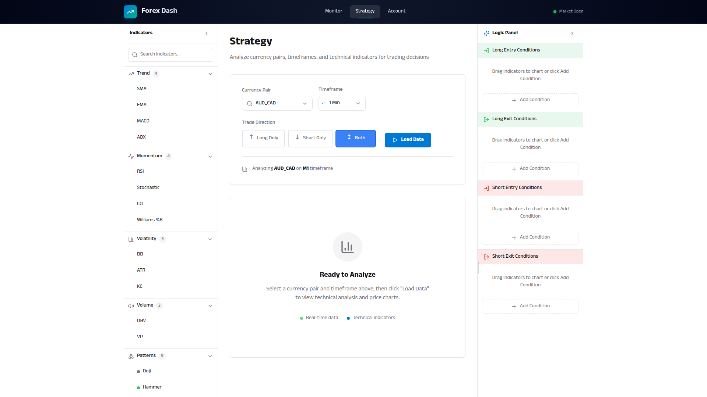
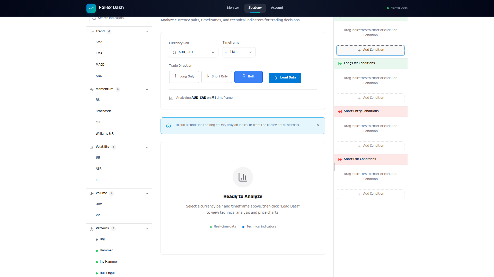

# Logic Builder Panel

**ADW ID:** a73d36d3
**Date:** 2026-01-19
**Specification:** specs/issue-64-adw-a73d36d3-sdlc_planner-view-logic-builder-panel.md

## Overview

This feature enhances the Logic Panel to provide a dedicated four-section logic builder for defining entry and exit conditions for both long and short trading strategies. The panel dynamically displays sections based on the selected trade direction, with visual distinction between long (green) and short (red) condition sections, and supports resizable width via a draggable border.

## Screenshots

## What Was Built

- Four-section layout for the Logic Panel: Long Entry, Long Exit, Short Entry, Short Exit
- Dynamic section visibility based on trade direction setting
- Visual distinction with green headers for long sections and red headers for short sections
- Resizable panel width via draggable left border (min: 200px, max: 480px)
- "Add Condition" button in each section
- Updated empty state instructional text: "Drag indicators to chart or click Add Condition"
- Panel width persistence to localStorage
- Migration support for legacy condition sections (entry/exit to long_entry/long_exit)
- E2E test specification for the feature

## Technical Implementation

### Files Modified

- `app/client/src/components/LogicPanel.jsx`: Complete refactor to support four sections with dynamic visibility, resize functionality, color-coded headers, and Add Condition buttons
- `app/client/src/pages/Strategy.jsx`: Updated to use V2 section types, added handleAddCondition callback, updated trade direction change logic for new sections
- `app/client/src/app/constants.js`: Added CONDITION_SECTIONS_V2, section labels, colors, types, and panel width constants
- `app/client/src/app/conditionDefaults.js`: Added V2 section types, migrateSectionToV2 helper, getDefaultSection function
- `app/client/src/index.css`: Added resize handle styles
- `.claude/commands/e2e/test_logic_builder_panel.md`: New E2E test specification

### Key Changes

- **Four-Section Architecture**: The panel now supports four distinct sections (Long Entry, Long Exit, Short Entry, Short Exit) instead of the original two (Entry, Exit)
- **Trade Direction Filtering**: Sections are dynamically shown/hidden based on the tradeDirection prop - "long" shows only long sections, "short" shows only short sections, "both" shows all four
- **Visual Color Coding**: Long sections use green background (`bg-success/10`) and icons, short sections use red background (`bg-destructive/10`) and icons
- **Resizable Panel**: Added a draggable resize handle on the left border with mouse event handlers, constrained to 200-480px width range, persisted to localStorage
- **Backward Compatibility**: Legacy 'entry' sections are migrated to 'long_entry', 'exit' to 'long_exit' via the migrateSectionToV2 function

## How to Use

1. Navigate to the Strategy page
2. The Logic Panel is displayed on the right side of the screen
3. Use the Trade Direction selector to choose "Long Only", "Short Only", or "Both"
   - Long Only: Shows Long Entry Conditions and Long Exit Conditions sections
   - Short Only: Shows Short Entry Conditions and Short Exit Conditions sections
   - Both: Shows all four sections
4. Drag the left border of the panel to resize it between 200px and 480px
5. Click the "Add Condition" button in any section to add a new condition (currently shows guidance message)
6. Drag conditions between sections by dragging and dropping
7. Click the collapse arrow to minimize the panel to a narrow icon bar
8. Click the collapsed panel to expand it back

## Configuration

- **LOGIC_PANEL_WIDTH_KEY**: localStorage key for panel width persistence (`forex_dash_logic_panel_width`)
- **LOGIC_PANEL_MIN_WIDTH**: Minimum panel width (200px)
- **LOGIC_PANEL_MAX_WIDTH**: Maximum panel width (480px)
- **LOGIC_PANEL_DEFAULT_WIDTH**: Default panel width (288px)
- **LOGIC_PANEL_COLLAPSED_KEY**: localStorage key for collapsed state (`forex_dash_logic_panel_collapsed`)

## Testing

Run the E2E test for this feature:
1. Read `.claude/commands/test_e2e.md` for test runner documentation
2. Execute `.claude/commands/e2e/test_logic_builder_panel.md` to validate:
   - Section visibility based on trade direction
   - Visual distinction (green/red headers)
   - Add Condition buttons
   - Resize functionality
   - Collapse/expand functionality
   - Empty state instructional text

Run validation commands:
- `cd app/client && npm run build` - Verify frontend builds without errors
- `cd app/server && uv run pytest` - Run server tests

## Notes

- The "Add Condition" button currently shows an informational message guiding users to drag indicators. Future enhancement could open a dialog to select an indicator/pattern directly
- When switching trade directions with existing conditions, a confirmation dialog warns about conditions that will be removed
- The panel width is persisted independently of the collapsed state
- Drag-and-drop between sections works seamlessly with the four-section layout
