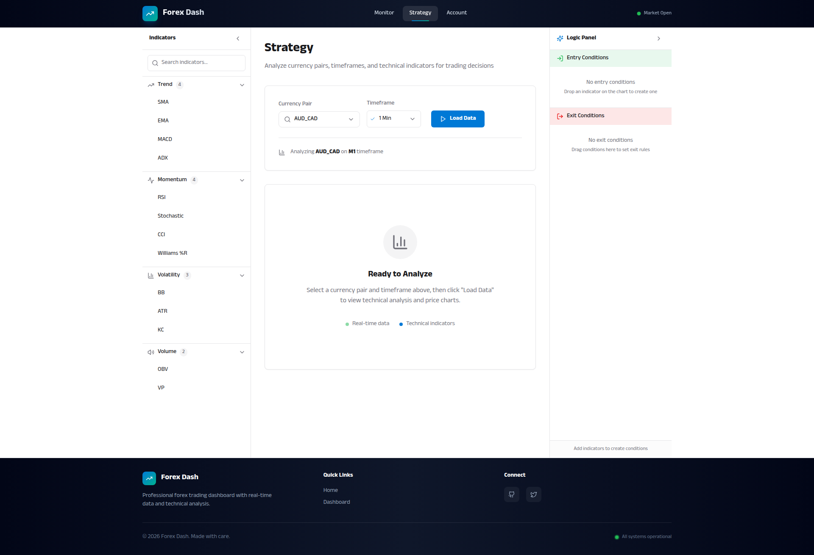
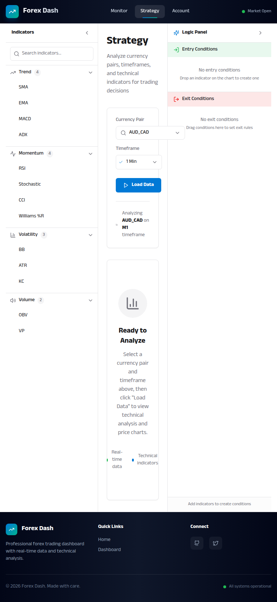

# Strategy Page Layout Redesign

**ADW ID:** b11af5b7
**Date:** 2026-01-19
**Specification:** specs/issue-50-adw-b11af5b7-sdlc_planner-redesign-strategy-layout.md

## Overview

Redesigned the Strategy page layout to reduce visual crowding and improve information hierarchy following the UI style guide. The redesign provides better spacing, clearer visual hierarchy, and more breathing room for key components, particularly prioritizing the chart visualization area.

## Screenshots

### Desktop Empty State

### Desktop with Technicals

### Mobile Layout with Floating Buttons

### Tablet Layout

## What Was Built

- **Improved spacing system**: Updated padding, margins, and gaps throughout the page to follow the UI style guide's 4px base unit system
- **Reorganized chart/technicals layout**: Changed from a three-column grid to a stacked full-width layout, giving the chart maximum horizontal space
- **Enhanced mobile experience**: Repositioned floating action buttons with better spacing and improved interactions
- **Consistent card design**: Applied uniform padding and spacing across all card components
- **Better responsive behavior**: Improved breakpoint handling for desktop, tablet, and mobile viewports
- **Empty state improvements**: Enhanced spacing and visual hierarchy in the empty state display

## Technical Implementation

### Files Modified

- `app/client/src/pages/Strategy.jsx`: Complete layout restructuring with improved spacing and responsive design
- `.claude/commands/e2e/test_strategy_page_layout.md`: New E2E test to validate the redesigned layout

### Key Changes

1. **Mobile Floating Buttons (Strategy.jsx:511-538)**
   - Increased button size from `w-12 h-12` to `w-14 h-14` for better touch targets
   - Changed bottom position from `bottom-4` to `bottom-6` to prevent content overlap
   - Added `pointer-events-none` to container and `pointer-events-auto` to buttons for proper click handling
   - Enhanced shadow from `shadow-lg` to `shadow-xl` for better visual hierarchy
   - Added hover scale animations (`hover:scale-105`, `active:scale-95`) for better interaction feedback

2. **Main Content Area Spacing (Strategy.jsx:541)**
   - Changed from `space-y-6` to `space-y-8` for better vertical breathing room
   - Added responsive padding: `px-4 md:px-6 lg:px-8` for optimal spacing at all breakpoints

3. **Controls Section (Strategy.jsx:553-554)**
   - Increased card padding from `p-6` to `p-6 lg:p-8` on larger screens
   - Changed control gaps from `gap-4` to `gap-6` for better visual separation
   - Updated border spacing from `mt-4 pt-4` to `mt-6 pt-6` in selected info badge

4. **Chart and Technicals Layout (Strategy.jsx:672-705)**
   - **Major structural change**: Removed `xl:grid-cols-3` three-column grid layout
   - Changed to stacked full-width layout using `space-y-8`
   - Chart now takes full width for maximum data visualization space
   - Technicals section displays below chart instead of beside it
   - This eliminates horizontal space competition between components

5. **Empty State Enhancements (Strategy.jsx:708-731)**
   - Increased vertical padding from `py-16` to `py-20 lg:py-24` for more spacious feel
   - Enlarged icon padding from `p-4` to `p-5` and icon size from `h-8 w-8` to `h-10 w-10`
   - Improved text spacing with larger gaps between elements
   - Added responsive flex direction for feature badges: `flex-col sm:flex-row`

6. **Error Display Improvements (Strategy.jsx:597-670)**
   - Consistent padding of `p-5` across all error/info cards (was `p-4`)
   - Increased gap between icon and content from `gap-3` to `gap-4`

## How to Use

The Strategy page layout improvements are automatically applied. Users will notice:

1. **More spacious chart area**: The chart now uses the full width of the main content area, providing better visibility for technical analysis

2. **Better organized information**: Controls, chart, and technicals are clearly separated with consistent spacing

3. **Improved mobile experience**:
   - Floating action buttons are larger and easier to tap
   - Buttons are positioned to avoid overlapping scrolled content
   - Better visual feedback on button interactions

4. **Clearer visual hierarchy**: Consistent padding and spacing make it easier to scan and understand the page structure

5. **Responsive design**: The layout adapts gracefully across desktop (>1024px), tablet (768-1024px), and mobile (<768px) viewports

## Configuration

No configuration is required. The layout improvements are applied automatically based on the viewport size.

## Testing

To test the layout improvements:

1. Start the application: `./scripts/start.sh`
2. Navigate to the Strategy page
3. Test at different screen sizes:
   - **Desktop**: Verify chart has ample space, controls are well-spaced
   - **Tablet**: Check responsive layout adaptation
   - **Mobile**: Confirm floating buttons don't overlap content
4. Load data and verify technicals display properly below the chart
5. Test sidebar collapse/expand functionality
6. Run the E2E test: `.claude/commands/e2e/test_strategy_page_layout.md`

### E2E Test Coverage

The new E2E test validates:
- Strategy page loads without visual crowding
- Controls section has proper spacing
- Chart and technicals use appropriate layout (stacked full-width)
- Mobile floating buttons are positioned correctly
- Layout works across multiple viewport sizes
- Empty state displays with proper spacing

## Notes

- This is a UI/UX refinement that maintains all existing functionality
- The primary goal was to reduce visual density and improve information hierarchy
- All spacing follows the UI style guide's 4px base unit system
- The chart receives priority for horizontal space, critical for technical analysis
- Mobile UX received special attention to prevent button overlap issues
- The three-column grid was replaced with a stacked layout for better space utilization
- Technicals section benefits from full-width display, allowing for better data presentation
- All existing features (collapsible panels, drag-drop, data loading) continue to work unchanged
