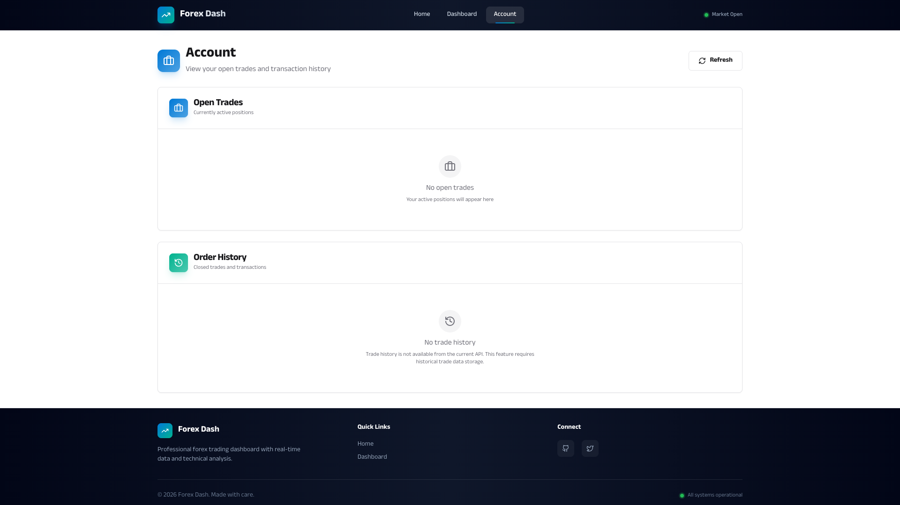
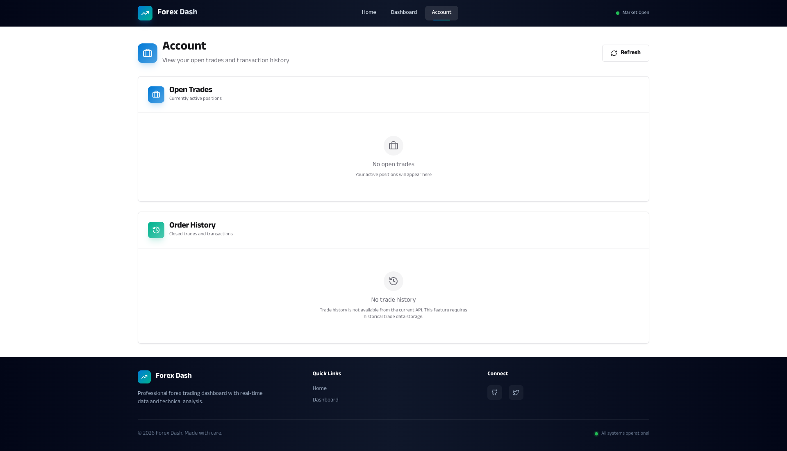

# Account Management - Open Trades & Trade History

**ADW ID:** bfd1a7d1
**Date:** 2026-01-16
**Specification:** specs/issue-1-adw-bfd1a7d1-sdlc_planner-account-open-trades-order-history.md

## Overview

This feature implements a dedicated Account page that displays the user's open trades and complete transaction/trade history. The implementation provides traders with a comprehensive view of their trading activity, including currently active positions with real-time profit/loss calculations and placeholder support for historical transactions.

## Screenshots

### Account Page Overview


The Account page displays open trades in a clean, tabular format with all critical trading information visible at a glance.

### Navigation Integration


The Account link has been added to the navigation bar for easy access from anywhere in the application.

### Full Account View


The complete Account page showing both Open Trades and Trade History sections with consistent styling.

## What Was Built

- **Account Page Component** - A dedicated page for viewing trading activity
- **Open Trades Section** - Displays all currently active trading positions with detailed information
- **Trade History Section** - Displays historical/closed trades using FXOpen Trade History API
- **Backend API Endpoints** - Two new REST endpoints for fetching trading data
- **Comprehensive Testing** - Unit tests for backend endpoints and E2E tests for UI functionality
- **Navigation Integration** - Account link added to the main navigation bar
- **Responsive UI** - Table-based layouts with loading states and empty state handling

## Technical Implementation

### Files Modified

**Backend:**
- `app/server/server.py`: Added two new API endpoints (`/api/trades/open` and `/api/trades/history`)
- `app/server/core/data_models.py`: Added `OpenTradesResponse` and `TradeHistoryResponse` Pydantic models
- `app/server/tests/test_trades_endpoints.py`: Created comprehensive unit tests for both endpoints

**Frontend:**
- `app/client/src/pages/Account.jsx`: Created new Account page with data fetching and refresh functionality
- `app/client/src/components/OpenTrades.jsx`: Created component for displaying open trades table (157 lines)
- `app/client/src/components/TradeHistory.jsx`: Created component for displaying trade history table (168 lines, renamed from OrderHistory.jsx)
- `app/client/src/App.jsx`: Added `/account` route to the router configuration
- `app/client/src/components/NavigationBar.jsx`: Added Account navigation link
- `app/client/src/app/api.js`: Added `openTrades()` and `tradeHistory()` API methods

**Testing:**
- `.claude/commands/e2e/test_account_page.md`: Created E2E test specification for Account page functionality

### Key Changes

1. **Backend API Endpoints**: Two new REST endpoints were added to `server.py`:
   - `GET /api/trades/open` - Returns all currently open trades by leveraging the existing `api.get_open_trades()` method
   - `GET /api/trades/history` - Returns trade history from FXOpen POST `/api/v2/tradehistory` endpoint with optional timestamp filters

2. **Data Models**: Reused existing `TradeInfo` model and created response models (`OpenTradesResponse`, `TradeHistoryResponse`) for structured API responses

3. **Frontend Components**: Built three new React components following the application's design system:
   - Account page with loading states, error handling, and refresh functionality
   - OpenTrades table component with conditional styling for profit/loss and buy/sell indicators
   - TradeHistory table component with date formatting and similar styling patterns

4. **Testing Coverage**: Added comprehensive unit tests for both endpoints covering success cases, empty responses, API failures, and error handling

5. **UI/UX Enhancements**:
   - Loading skeleton states during data fetching
   - Empty states with helpful messages
   - Refresh button with visual feedback
   - Color-coded profit/loss indicators (green for positive, red for negative)
   - Buy/sell badges with directional icons
   - Responsive table layouts with proper number formatting

## How to Use

### Accessing the Account Page

1. Navigate to the application in your browser
2. Click the "Account" link in the navigation bar
3. The Account page will load and display your trading data

### Viewing Open Trades

The Open Trades section displays:
- **Instrument**: The trading pair (e.g., EUR/USD, GBP/USD)
- **Side**: Buy (green badge with up arrow) or Sell (red badge with down arrow)
- **Amount**: The position size in units
- **Entry Price**: The price at which the trade was opened (5 decimal precision)
- **P/L**: Real-time unrealized profit/loss (color-coded: green for profit, red for loss)
- **Margin**: The margin used for the position
- **SL**: Stop Loss level (if set)
- **TP**: Take Profit level (if set)

### Refreshing Data

Click the "Refresh" button in the top-right corner to manually update trading data. The button shows a spinning animation during the refresh operation.

### Understanding Trade History

The Trade History section displays closed trades and historical transactions fetched from the FXOpen Trade History API. It shows the last 30 days of trading activity by default, including executed orders, position closures, and balance movements.

## Configuration

No additional configuration is required. The feature uses the existing OpenFX API configuration from the application settings.

## Testing

### Running Backend Tests

```bash
cd app/server
uv run pytest
```

The test suite includes:
- Successful open trades retrieval with multiple trades
- Successful open trades retrieval with empty result
- API failure handling when `get_open_trades()` returns None
- Exception handling for connection errors
- Trade history endpoint structure validation

### Running E2E Tests

Follow the instructions in `.claude/commands/test_e2e.md` and execute `.claude/commands/e2e/test_account_page.md` to validate the feature end-to-end.

### Running Frontend Build

```bash
cd app/client
npm run build
```

## Notes

### API Integration

The OpenFX API has a `get_open_trades()` method for current positions and a `get_trade_history()` method that calls the FXOpen POST `/api/v2/tradehistory` endpoint. The trade history endpoint accepts timestamp filters and returns historical trading records including transaction details, position data, and balance movements.

### Future Enhancements

To enhance trade history functionality, consider:
- Adding pagination for large trade histories (currently limited to 1000 records per request)
- Implementing date range filters in the UI for custom history queries
- Adding export functionality (CSV, PDF)
- Implementing a database layer for faster historical queries and caching
- Adding trade detail views with full transaction information

### Design Consistency

The implementation strictly follows the application's style guide:
- Uses Tailwind CSS utility classes from `app/client/src/index.css`
- Follows card-based component patterns (`card`, `card-header`, `card-title`, `card-content`)
- Uses consistent table styling (`table`, `table-header`, `table-body`, `table-row`, `table-head`, `table-cell`)
- Applies `tabular-nums` class for proper number alignment
- Uses standard color tokens (`text-success`, `text-destructive`, `text-muted-foreground`)
- Implements loading states with skeleton animations
- Provides empty states with helpful icons and messages

### Performance Considerations

- Data fetching uses `Promise.all()` to load open trades and history in parallel
- The refresh operation provides visual feedback and disables the button during loading
- Tables are responsive with horizontal scrolling on smaller screens
