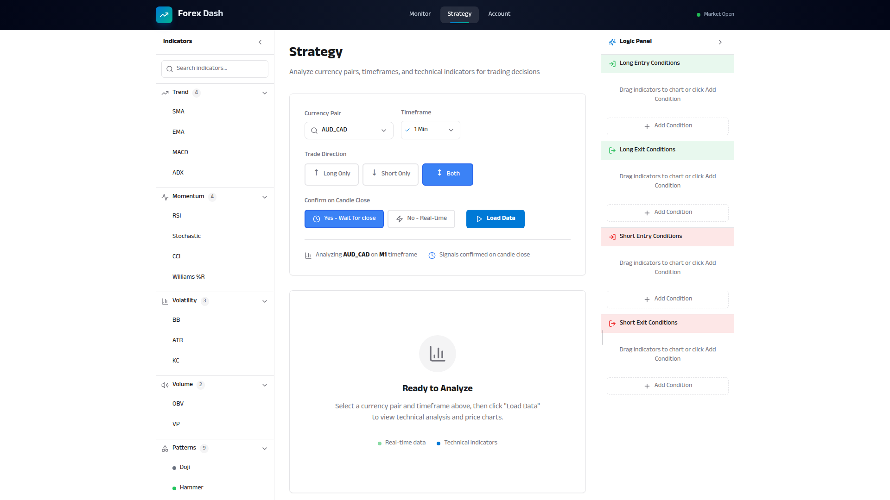
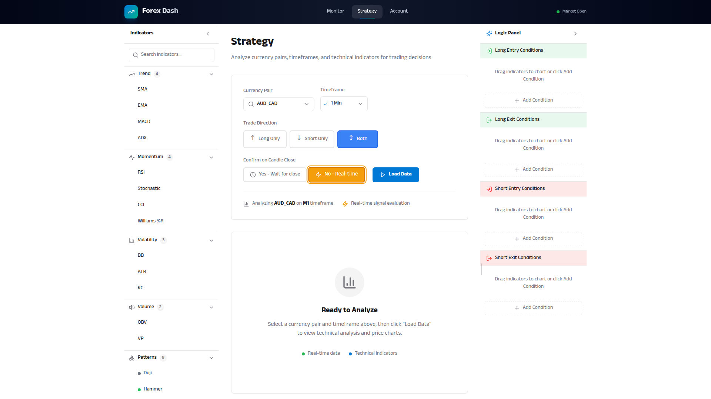
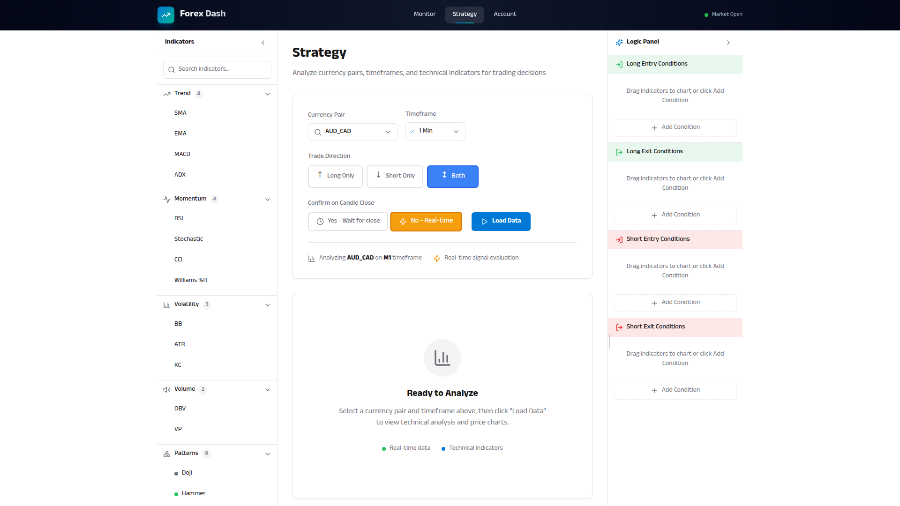

# Candle Close Confirmation

**ADW ID:** d3028e00
**Date:** 2026-01-20
**Specification:** specs/issue-70-adw-d3028e00-sdlc_planner-candle-close-confirmation.md

## Overview

This feature adds a configurable toggle that allows traders to choose whether entry signals should trigger immediately on real-time price data (each tick) or wait for the candle to close before evaluating conditions. This is a critical trading configuration that impacts signal reliability versus entry speed.

## Screenshots







## What Was Built

- **CandleCloseToggle Component**: New reusable component with Yes/No buttons for selecting confirmation mode
- **Strategy Page Integration**: Toggle integrated into the Controls Card section with state management
- **localStorage Persistence**: User preference persists across page reloads and sessions
- **Visual Indicators**: Clock icon for "Wait for close" mode, Zap icon for "Real-time" mode
- **E2E Test Specification**: Comprehensive test coverage for the feature

## Technical Implementation

### Files Modified

- `app/client/src/app/constants.js`: Added constants for candle close confirmation (values, labels, storage key, tooltip)
- `app/client/src/components/CandleCloseToggle.jsx`: New component for the Yes/No toggle with tooltips and accessibility
- `app/client/src/pages/Strategy.jsx`: Integrated toggle with state management and localStorage persistence
- `.claude/commands/e2e/test_candle_close_confirmation.md`: E2E test specification

### Key Changes

- Added `CANDLE_CLOSE_CONFIRMATION` enum with `YES` and `NO` values
- Created accessible toggle buttons with `aria-label` and `aria-pressed` attributes
- Implemented keyboard navigation support (Enter, Space)
- Blue highlighting for "Yes - Wait for close" active state, amber for "No - Real-time"
- Tooltips explain the trade-off between signal reliability and entry speed

## How to Use

1. Navigate to the Strategy page
2. Locate the "Confirm on Candle Close" toggle in the Controls Card
3. Select "Yes - Wait for close" (default) to have entry conditions evaluate only after candle closes
4. Select "No - Real-time" to have entry conditions evaluate on each price tick
5. The setting persists automatically across page reloads

## Configuration

- **localStorage Key**: `forex_dash_candle_close_confirmation`
- **Default Value**: `yes` (wait for candle close)
- **Options**:
  - `yes`: Conditions only evaluate as true after the candle closes
  - `no`: Conditions evaluate in real-time on each tick

## Testing

Run the E2E test to validate the feature:
```bash
# Read and execute the test specification
# .claude/commands/e2e/test_candle_close_confirmation.md
```

## Notes

- Exit conditions always evaluate in real-time for safety (not affected by this setting)
- The setting is prepared for future integration with condition evaluation logic in the trading bot
- Uses Lucide React icons: Clock for candle close confirmation, Zap for real-time evaluation
