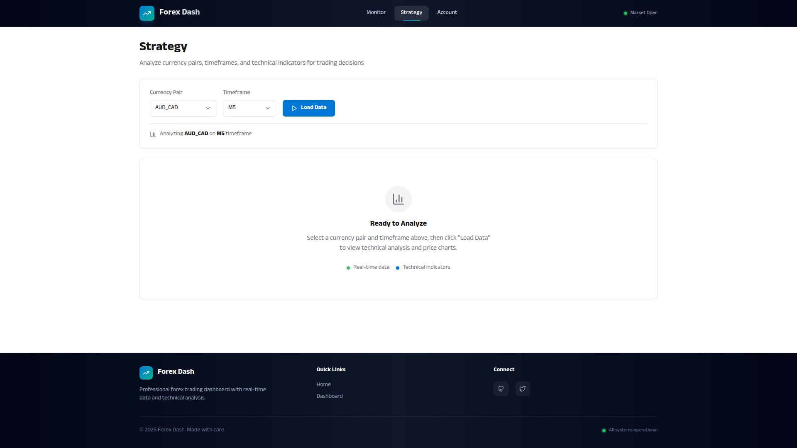

# Interactive OHLC Candlestick Chart

**ADW ID:** dc50bbc5
**Date:** 2026-01-18
**Specification:** specs/issue-30-adw-dc50bbc5-sdlc_planner-interactive-ohlc-candlestick-chart.md

## Overview

This feature adds a fully interactive OHLC (Open-High-Low-Close) candlestick chart to the Strategy page, allowing traders to analyze price action patterns for forex currency pairs across multiple timeframes. The implementation uses Plotly.js for high-performance visualization with support for multiple chart types, volume indicators, interactive controls, and customizable date ranges.

## Screenshots


*Strategy page empty state before loading data*


*Error handling with dismissible alert*

## What Was Built

- **Interactive Candlestick Chart**: High-performance Plotly.js chart with zoom, pan, and hover tooltips
- **Multiple Chart Types**: Candlestick, OHLC, Line, and Area chart visualization modes
- **Volume Indicator**: Toggle-able volume bars displayed below the main price chart
- **Date Range Selection**: Quick buttons for 1D, 5D, 1M, 3M, 6M, YTD, 1Y, and All time ranges
- **Loading States**: Animated spinner and skeleton UI during data fetch
- **Empty State**: Clear messaging when no data is loaded
- **Error Handling**: Dismissible error alerts with proper visual hierarchy
- **Auto-scaling Y-axis**: Dynamic price range adjustment with forex precision (5 decimal places)
- **Responsive Design**: Adapts to mobile, tablet, and desktop viewports

## Technical Implementation

### Files Modified

- **app/client/src/components/PriceChart.jsx**: Added loading state prop and loading skeleton UI with animated spinner. Conditionally renders loading skeleton or chart based on `loading` prop.

- **app/client/src/pages/Strategy.jsx**: Added `loading={loadingData}` prop to PriceChart component to pass loading state from parent component.

- **app/client/src/app/chart.js**: Refined color values to exact hex format matching UI style guide (`#22c55e` for bullish, `#ef4444` for bearish) with improved color comments for dark mode compliance.

- **.claude/commands/e2e/test_candlestick_chart.md**: Comprehensive E2E test specification with 141 test steps covering all chart functionality, interactions, and edge cases.

### Key Changes

- **Loading State Enhancement**: Implemented animated loading skeleton with dual-ring spinner (pulsing border + spinning overlay) centered in chart container, displaying "Loading chart data..." message
- **Color Compliance**: Updated chart colors to exact lowercase hex values (`#22c55e`, `#ef4444`) matching the UI style guide for consistent visual design
- **Loading Prop Integration**: Added `loading` prop to PriceChart component and updated useEffect dependency array to prevent chart rendering during loading state
- **Conditional Rendering**: Chart now conditionally renders loading skeleton when `loading=true` or the actual Plotly chart when data is loaded and `loading=false`
- **E2E Test Coverage**: Created comprehensive test specification covering 25+ verification points including chart types, volume, date ranges, interactions, performance, and accessibility

## How to Use

### Basic Usage

1. Navigate to the **Strategy** page from the main navigation
2. Select a currency pair from the dropdown (e.g., "EUR/USD")
3. Select a timeframe/granularity (e.g., "H1" for 1-hour candles)
4. Click **"Load Data"** button
5. View the interactive candlestick chart with price data

### Chart Type Selection

- Use the **chart type selector** dropdown to switch between:
  - **Candlestick**: Traditional OHLC candles with colored bodies (default)
  - **OHLC**: Bar-style OHLC representation
  - **Line**: Simple line chart showing close prices
  - **Area**: Filled area chart below the close price line

### Volume Indicator

- Click the **volume toggle button** (BarChart icon with "Vol" text) to show/hide volume bars
- Volume bars appear below the main price chart with color-coding:
  - Green for bullish volume (close >= open)
  - Red for bearish volume (close < open)

### Date Range Selection

- Click any **date range button** to quickly load specific time periods:
  - **1D**: Last 1 day of data
  - **5D**: Last 5 days
  - **1M**: Last 1 month
  - **3M**: Last 3 months
  - **6M**: Last 6 months
  - **YTD**: Year-to-date
  - **1Y**: Last 1 year
  - **All**: Maximum available data (up to 1000 candles)
- The selected date range button is highlighted with primary color
- Candle count is automatically calculated based on timeframe and date range

### Interactive Features

- **Zoom**: Scroll mouse wheel over chart to zoom in/out
- **Pan**: Click and drag to pan horizontally across the chart
- **Reset**: Double-click the chart to reset zoom to original view
- **Hover**: Move mouse over candles to see OHLC tooltip with precise values
- **Crosshair**: Hover displays crosshair spike lines on X and Y axes for easy reading

## Configuration

No additional configuration is required. The chart uses existing API endpoints and integrates with the current Strategy page infrastructure:

- **API Endpoint**: `/api/prices/{pair}/{granularity}/{count}` - Returns OHLC data arrays (`time, mid_o, mid_h, mid_l, mid_c`)
- **Chart Container**: Uses responsive sizing with `min-h-[500px]` and dynamic height `calc(100vh - 450px)`
- **Performance**: Optimized for up to 1000 candles with Plotly.js built-in WebGL acceleration
- **Color Scheme**: Follows UI style guide with bullish green (#22c55e) and bearish red (#ef4444)

## Testing

### E2E Test Execution

Run the comprehensive end-to-end test to validate all functionality:

```bash
# Read and execute the E2E test specification
# See: .claude/commands/e2e/test_candlestick_chart.md
```

The E2E test covers:
- Empty state and loading state verification
- Chart rendering with candlestick data
- All 4 chart type switches (Candlestick, OHLC, Line, Area)
- Volume toggle on/off
- All 8 date range buttons (1D, 5D, 1M, 3M, 6M, YTD, 1Y, All)
- Interactive features (zoom, pan, hover tooltips, double-click reset)
- Y-axis auto-scaling and X-axis time formatting
- Performance with 1000 candles
- Responsive design on mobile/tablet/desktop
- Error handling and accessibility

### Manual Testing

1. **Loading State**: Select a pair/timeframe and click "Load Data" - verify animated spinner appears
2. **Chart Rendering**: Verify candlestick chart renders with correct green/red color-coding
3. **Chart Types**: Switch between all 4 chart types and verify visual changes
4. **Volume**: Toggle volume on/off and verify bars appear/disappear
5. **Date Ranges**: Click each date range button and verify chart updates with appropriate data
6. **Interactions**: Test zoom (mouse wheel), pan (drag), hover tooltips, and double-click reset
7. **Performance**: Load 1000 candles (select "All" date range) and verify smooth performance

## Notes

### Style Guide Compliance

All UI components follow the established style guide:
- **Colors**: Exact hex values (#22c55e bullish, #ef4444 bearish) matching `ai_docs/ui_style_guide.md`
- **Typography**: Anek Odia font family with proper weights
- **Spacing**: 4px base unit system for margins and padding
- **Components**: Uses card, button, and loading state patterns from style guide
- **Accessibility**: Keyboard navigation, focus indicators, and ARIA labels included

### Performance Considerations

- Chart is optimized for up to 1000 candles per the specification
- Plotly.js provides built-in WebGL acceleration for smooth rendering
- Loading skeleton prevents rendering until data is fully loaded
- Responsive sizing ensures chart adapts to container dimensions

### Integration Points

- **Strategy.jsx**: Manages state for selectedPair, selectedGran, priceData, and loadingData
- **PriceChart.jsx**: Receives props and handles chart-specific rendering and controls
- **chart.js**: Contains `drawChart()` function with Plotly configuration and rendering logic
- **Technicals Sidebar**: Chart occupies xl:col-span-2 layout alongside technicals component

### Future Enhancements

The following features were considered but not included in this implementation (potential future iterations):
- Technical indicator overlays (moving averages, Bollinger Bands, RSI)
- Drawing tools (trend lines, support/resistance levels)
- Multi-timeframe analysis in split view
- Chart pattern recognition and alerts
- Export chart as image or PDF
- Save/load chart configurations
- Real-time price updates via WebSocket
- Comparison with multiple currency pairs on same chart
