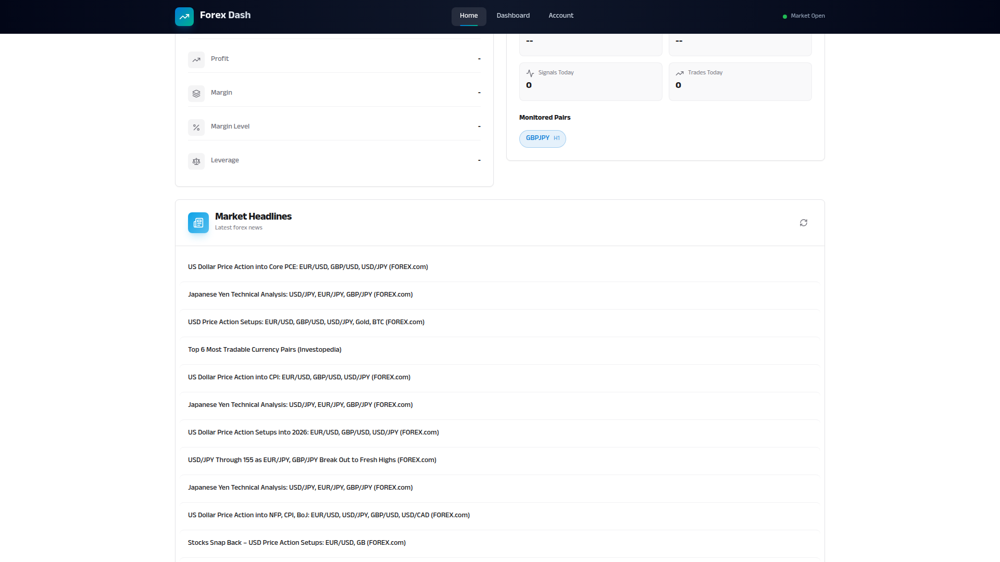
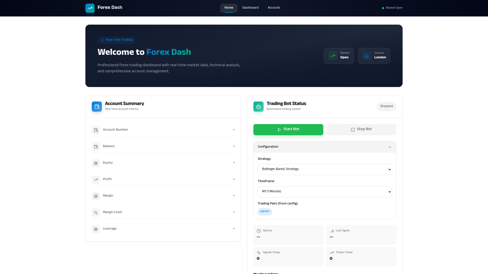
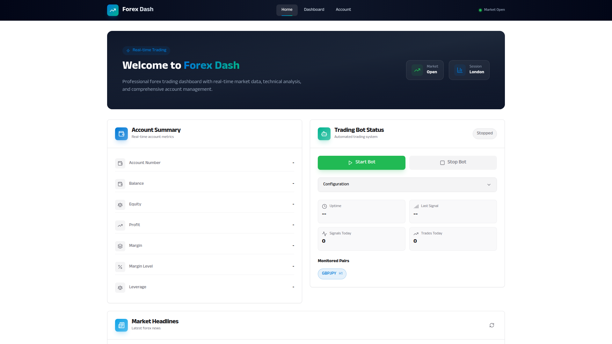

# Bot Start/Stop Control

**ADW ID:** edc8ccb5
**Date:** 2026-01-18
**Specification:** /home/ubuntu/algotrading/trees/edc8ccb5/specs/issue-25-adw-edc8ccb5-sdlc_planner-bot-start-stop-control.md

## Overview

This feature enables traders to start and stop the automated trading bot directly from the dashboard UI without needing terminal access. It implements a BotController class that manages the bot subprocess lifecycle, new API endpoints for bot control operations (start/stop/restart), and UI controls integrated into the existing BotStatus component with confirmation dialogs and toast notifications.

## Screenshots









## What Was Built

- **BotController singleton class** - Manages subprocess lifecycle with PID tracking, lock file mechanism, and graceful shutdown handling
- **API endpoints** - POST endpoints for `/api/bot/start`, `/api/bot/stop`, and `/api/bot/restart` with proper validation and error handling
- **Start/Stop control buttons** - UI buttons with loading states integrated into BotStatus component
- **Configuration panel** - Collapsible section for selecting strategy and timeframe before starting the bot
- **Confirmation dialog** - Modal that appears when stopping the bot to prevent accidental stops
- **Toast notifications** - Success/error feedback for bot control operations
- **E2E test specification** - Test file for validating bot control functionality

## Technical Implementation

### Files Modified

- `app/server/core/bot_controller.py` (new): BotController singleton class with subprocess management, lock file mechanism, PID tracking, and graceful shutdown
- `app/server/server.py`: Added three new API endpoints for bot start/stop/restart operations
- `app/server/core/data_models.py`: Added `BotStartRequest` and `BotControlResponse` Pydantic models
- `app/server/core/bot_status.py`: Enhanced to include `can_start`/`can_stop` flags and PID tracking
- `app/client/src/components/BotStatus.jsx`: Added control buttons, configuration panel, confirmation dialog, and toast notifications
- `app/client/src/app/api.js`: Added `botStart`, `botStop`, and `botRestart` API client methods
- `app/client/src/lib/utils.js`: Added CSS utility function
- `.claude/commands/e2e/test_bot_control.md` (new): E2E test specification

### Key Changes

- **Singleton BotController**: Thread-safe singleton pattern ensures only one controller instance manages the bot process
- **Lock file mechanism**: Prevents multiple bot instances from running simultaneously using `app/server/.bot.lock`
- **Graceful shutdown**: SIGTERM sent first, then SIGKILL after 5-second timeout if process doesn't terminate
- **Status tracking integration**: BotController integrates with BotStatusTracker to provide real-time status updates
- **Transitional states**: Added "starting" and "stopping" states for proper UI feedback during transitions

## How to Use

1. Navigate to the trading dashboard where the BotStatus component is displayed
2. When the bot is stopped, the "Start Bot" button (green) will be enabled
3. Click the Configuration dropdown to select strategy and timeframe before starting
4. Click "Start Bot" to start the trading bot - a loading spinner appears during startup
5. Once running, the status badge shows "Running" and the "Stop Bot" button (red) becomes enabled
6. Click "Stop Bot" to stop the trading bot - a confirmation dialog appears
7. Click "Confirm" in the dialog to proceed with stopping the bot
8. Toast notifications appear confirming success or showing error messages

## Configuration

- **Strategy selection**: Currently supports "Bollinger Bands Strategy" (default)
- **Timeframe options**: M1, M5, M15, H1, H4, D (default: M1)
- **Graceful shutdown timeout**: 5 seconds (configurable in BotController.GRACEFUL_SHUTDOWN_TIMEOUT)
- **Heartbeat interval**: 30 seconds (configurable in BotController.HEARTBEAT_INTERVAL)
- **Log files**: Bot stdout/stderr redirected to `app/server/logs/bot_stdout.log` and `bot_stderr.log`

## Testing

### Unit Tests
- `app/server/tests/test_bot_controller.py` - Tests for BotController subprocess management
- `app/server/tests/test_bot_control_endpoints.py` - Tests for API endpoint behavior
- `app/server/tests/test_bot_status_endpoint.py` - Regression tests for existing bot status

### Run Tests
```bash
cd app/server && uv run pytest tests/test_bot_controller.py -v
cd app/server && uv run pytest tests/test_bot_control_endpoints.py -v
cd app/server && uv run pytest -v  # All server tests
```

### E2E Tests
Read and execute `.claude/commands/e2e/test_bot_control.md` for end-to-end validation

## Notes

- The bot subprocess is spawned using `uv run python run.py` from the `app/bot` directory
- Only one bot instance can run at a time - the lock file prevents duplicate starts
- Stale lock files (from crashed processes) are automatically detected and cleaned up on startup
- The PID is displayed in the UI footer when the bot is running
- For production use, consider adding WebSocket support for real-time status updates instead of polling
